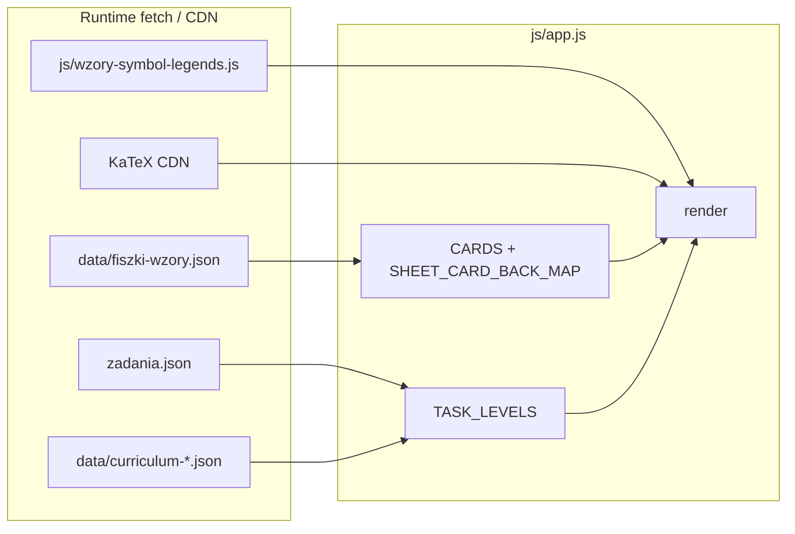
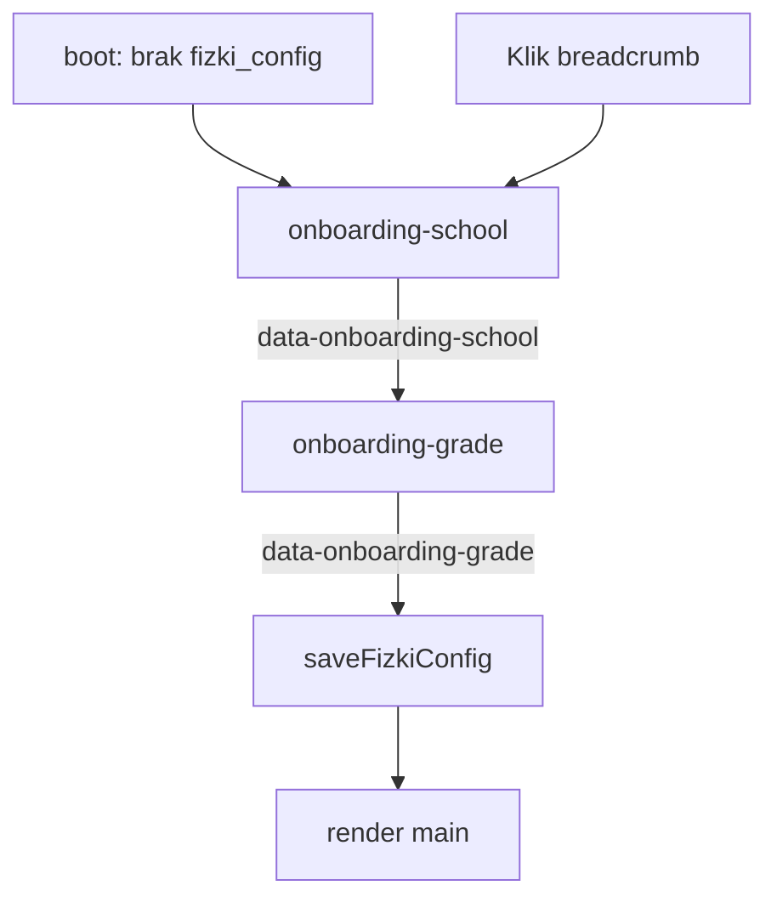

# Single Source of Truth — stan aplikacji „Fiszki”

Dokument opisuje **aktualny stan** repozytorium: źródła JSON, jeden plik `js/app.js` (router + render + logika), `css/styles.css`, `index.html` oraz **pełną specyfikację UX** (nawigacja, layout, motywy, mobile/PWA, dostępność, stany brzegowe).

**Dla agentów / audytu UX:** sekcja **§3** jest samowystarczalna — po jej przeczytaniu można przeprowadzić dogłębny audyt interfejsu bez przeglądania całego kodu. Sekcje **§1–2** opisują dane i logikę (**§1.5–1.6** — shell i CMS; **§2.5** — onboarding i `fizki_config`); **§4** mapuje klasy CSS; **§5** — pliki. Makiety demo (role, nauczyciel, confetti): **§3.13**.

**Produkcja:** https://fizki.pl (PWA, Vercel). Brak routingu URL per ekran — stan w pamięci + `history.pushState` bez zmiany ścieżki.

---

## 1. Struktura danych i powiązania

### 1.1 `data/fiszki-wzory.json` (fiszki / wzory CKE — **używane w runtime**)

- **Ładowanie:** `fetch("data/fiszki-wzory.json")` w `loadFiszkiWzory()` na początku `boot()`.
- **Format:** obiekt z polami `version`, `source` (informacyjnie: źródło `js/cards-wzory-cke.js`), tablica **`cards`**.
- **Pojedyncza karta (`cards[]`):**

| Pole | Znaczenie |
|------|-----------|
| `topic` | Nazwa działu (jak na karcie CKE). |
| `name` | Nazwa wzoru — w aplikacji **`front`** (zgodność z legendą i `sheetCardRefs` w zadaniach). |
| `symbol` | LaTeX lewej strony pierwszej relacji (`=`, `\le`, `\ge`, `\approx`) — w aplikacji **`symbolLatex`**; pusty / brak sensownego LHS → `null`. |
| `correct_latex` | Poprawny wzór KaTeX — mapowany na **`back`**. |
| `distractors` | Zwykle **3** łańcuchy LaTeX — **`quizDistractors`**. W quizie fiszek (**`buildFlashQuizChoices`**) trzy błędne odpowiedzi to najpierw losowe **`back`** innych kart z **tego samego działu** (`topic`), potem z całego poziomu (**`cardsForHomeLevel`**), potem z **`quizDistractors`**, na końcu z globalnego **`CARDS`**; kolejność czterech wariantów — **`fisherYatesShuffle`**. |

- **Regeneracja:** `node tools/gen-fiszki-wzory-json.mjs` (wejście: `js/cards-wzory-cke.js` → wyjście: `data/fiszki-wzory.json`). `cards-wzory-cke.js` **nie** jest `<script>` w `index.html`.

- **Legenda symboli:** `js/wzory-symbol-legends.js` ustawia `window.__WZORY_SYMBOL_LEGEND__`. Klucz = **`sheetSymbolLegendKey(topic, front)`** = `trim(topic) + '\x1e' + trim(front)` (`front` = `name` z JSON). Generator: `python tools/gen_wzory_symbol_legends.py` (spójny klucz po `.strip()` w skrypcie).

- **Zadania:** opcjonalne **`sheetCardRefs`** — pary `[topic, nazwaKarty]`; druga wartość = `name` / `front` fiszki, żeby `getTaskSheetLines()` i `SHEET_CARD_BACK_MAP` znalazły ten sam wzór co legenda.

### 1.2 `zadania.json` (katalog główny — **źródło zadań w runtime**)

- **Ładowanie:** `fetch("zadania.json")` w `loadZadaniaJson()` w `boot()` — nadpisuje **`TASK_LEVELS`**. Tablica poziomów obejmuje co najmniej **`lo-rozszerzenie`**, **`lo-podstawa`**, **`sp`** (id muszą zgadzać się z **`CURRICULUM_FILES`** / menu), każdy z własną tablicą **`sections`**. Dla każdego poziomu normalizowane są `sections` i `tasks` (puste tablice, gdy brak w JSON).
- **Jedyny plik zadań w przeglądarce** — nie ma osobnego `data/gemini-zadania.json` w tym przepływie.

**Bramka (`task-detail`):** **`taskNeedsAnswerGate(t)`** — true, gdy zadanie ma interaktywną bramkę wg **`taskType`**:

| `taskType` | Warunek bramki | UI bramki |
|------------|----------------|-----------|
| **`open`** (domyślny) | **`formulaQuiz.choices.length ≥ 4`** (legacy) | Quiz wzorów — jak wcześniej (`data-task-quiz-opt`) |
| **`math`** | niepusty **`mathValue`** | Pole **`#task-math-input`** + **Sprawdź**; opcjonalnie **`mathUnit`** w etykiecie; tolerancja **`checkMathAnswer`** (2% lub ±0,01 przy exact=0) |
| **`abcd`** | **`abcdOptions.length ≥ 4`** | Cztery przyciski **`data-task-abcd-opt`** |

**2-Strike (math / abcd):** pierwszy błąd — **`handleTaskWrongAttempt`** → wstrząs (`.shake`) + podpowiedź; drugi — ujawnienie poprawnej odpowiedzi (**`taskMathRevealed`** / podświetlenie opcji) i **`unlockTaskWithSolution()`** (bez confetti).

**Pola opcjonalne zadania:** **`difficulty`** (1–3, gwiazdki **`taskDifficultyStarsHtml`** na liście i w tytule), **`taskType`**, **`mathValue`**, **`mathUnit`**, **`abcdOptions`** (`text`, `isCorrect`).

Dla **`open`** + **`formulaQuiz`**: przyciski „Pokaż wzory / odpowiedź / pełne rozwiązanie” są **`disabled`** + **`btn-gated`**, dopóki **`taskQuizSolved`**. Opcje quizu: **`quiz-options quiz-options--stack task-quiz-options`** (jedna kolumna); każda opcja w **`.task-quiz-option-cell`** (przycisk + ewentualny blok rationale pod błędnym wyborem).

**Schemat `formulaQuiz`:**

| Pole | Typ | Opis |
|------|-----|------|
| `lhsLatex` | string | LHS / symbol kontekstu (m.in. legenda dopasowana przez `taskFormulaQuizLegendHaystack`). |
| `prompt` | string | Treść pytania (mixed → `richMixedLinesToHtml`). |
| `choices` | tablica (oczekiwane **4** obiekty) | `katex`, `correct`, opcjonalnie `distractorRationale`. |

**`distractorRationale`:** pod wybraną błędną opcją (`.task-quiz-option-rationale`), po **`richMixedLinesToHtml`**.

**Po odblokowaniu bramki:** pod **`#task-solution`** — **`.task-quiz-symbol-legend`** (symbole z bazy legendy dopasowane do łańcucha z quizu).

### 1.3 `data/curriculum-*.json`

| Plik | Poziom (`level.id`) |
|------|----------------------|
| `curriculum-lo-rozszerzenie.json` | `lo-rozszerzenie` |
| `curriculum-lo-podstawa.json` | `lo-podstawa` |
| `curriculum-sp.json` | `sp` |

- **Ładowanie:** `loadCurriculaAndLinks()` — błąd HTTP → wyjątek → **`showAppBootError()`**.
- **Treść:** drzewo **`curriculum`**; liście mogą mieć **`sectionRefs`** (id sekcji z `level.sections`). **UI:** ekran **`task-chapters`** pokazuje drzewo programu filtrowane przez **`userGrade`** (`getEffectiveClassFilterId()` → `sectionsForTaskClassFilter` / `renderTaskCurriculumTreeHtml`); przy **`userGrade === 'all'`** — pełne drzewo z nagłówkami klas; przy konkretnej klasie — tylko jej poddrzewo. Bez planu — płaska lista **`level.sections`**. Zawsze widać działy **z 0 zadań** (**`tasksLabel`**). **`getTaskSectionView`** scala zadania z wielu **`sectionRefs`** przy wejściu z liścia programu.
- **Powiązania:** `CURRICULUM_LINKS_BY_LEVEL`, `applyStaticCurriculumLinks`, `augmentGeminiCurriculumRefs`, **`applyHeuristicCurriculumSectionRefs`** (dla **`lo-podstawa`** i **`sp`** — domyślne `sectionRefs` dla liści bez jawnego mapowania), `syncCurriculumImportFolder` (folder „import” z nieprzypiętymi sekcjami).

### 1.4 Diagram zależności (uproszczony)



### 1.5 Shell (`index.html`)

Struktura statyczna (poza `#app` całość UI jest w JS):

```
body (flex column, min-height 100dvh)
├─ .app-shell (max-width 28rem, wyśrodkowany)
│  ├─ header.app-brand — logo + breadcrumb profilu + mock logowanie ról
│  └─ #app.app — dynamiczny UI (render)
├─ footer.app-footer (max-width 28rem) — Znajdź Nauczyciela + PWA + motyw
├─ #login-modal — modal logowania (mock + demo ról)
├─ #student-dashboard — modal profilu ucznia
├─ #teacher-dashboard — modal profilu nauczyciela
├─ #quiz-creator-modal — kreator sprawdzianu (B2B, makieta)
├─ #teacher-modal — modal „Znajdź Nauczyciela” (frontend mock)
└─ #quiz-success-toast — toast po „generowaniu kartkówki” (makieta)
```

| Element | Rola UX |
|---------|---------|
| **`header.app-brand`** | Wyśrodkowany blok: logo SVG + **`#app-mini-breadcrumb`** + **`nav.app-auth-nav`**. |
| **`#app-auth-login`** | Przycisk **`#btn-open-login`** („👤 Zaloguj się”) — otwiera modal logowania. Ukrywany po zalogowaniu demo (**`.hidden`**). |
| **`#profile-student`**, **`#profile-teacher`** | Awatar (ui-avatars.com) + etykieta roli + **`[data-auth-logout]`** „Wyloguj”. Klasa **`.hidden`** gdy nieaktywne. |
| **`#login-modal`** | Modal logowania: **`.modal-content`**, nagłówek „Witaj w Fizkach”, mock formularz (Email/Hasło, zablokowany **Zaloguj**), separator demo, **`#btn-login-demo-student`**, **`#btn-login-demo-teacher`**, **`#login-modal-close`**, **`#login-modal-backdrop`**. Domyślnie **`.hidden`**. |
| **`#student-dashboard`** | Modal profilu ucznia (po demo ucznia, klik **`#profile-student`**): hero (awatar, imię, streak), statystyki, sekcja programu (**`#student-level-select`**, **`#student-grade-select`**) — zapis **`fizki_config`** bez nawigacji; sekcja dołączenia do klasy (**`#input-join-code`**, **`#btn-join-class`**) — makieta: toast + zamknięcie modala. **`#student-modal-close`**, **`#student-modal-backdrop`**, Escape. |
| **`#teacher-dashboard`** | Modal profilu nauczyciela (klik **`#profile-teacher`**): hero, drill-down **`#t-view-main`** (analityka + **`t-class-nav-btn`**) ↔ **`#t-view-class-detail`** (**`#btn-t-view-back`**, lista uczniów z akordeonem), **`#btn-t-add-class`** (toast). **`resetTeacherDashboardView()`** przy otwarciu/zamknięciu. |
| **`#app`** | Jedyny kontener dynamiczny; klasa **`app`**; padding `0.5rem 1rem 1rem`. |
| **`footer.app-footer`** | **`#btn-find-teacher`**, `#pwa-install-hint`, `#pwa-install`, `#theme-toggle` — poza `#app`, zawsze widoczne. |
| **`#teacher-modal`** | Modal z listą mock nauczycieli (`MOCK_TEACHERS` → **`renderTeachers()`**); backdrop + **`#teacher-modal-close`**. |
| **`#teacher-task-tools`** | Pasek B2B w widoku zadań (`.app-shell`, nad **`#app`**): widoczny gdy **`mockUserRole === 'teacher'`** i **`screen`** ∈ **`task-chapters` \| `task-detail`**. **`#btn-open-quiz-creator`**. |
| **`#quiz-creator-modal`** | Modal kreatora sprawdzianu: checkboxy zadań (mock), **`#quiz-creator-class`**, **`#btn-share-quiz`**. |
| **`#quiz-success-toast`** | Zielony toast sukcesu (**`showToast()`**); **`aria-live="polite"`**. |
| **FOUC motywu** | Inline script w `<head>`: `localStorage.fizki_theme` → `document.documentElement.dataset.theme` + `meta theme-color`. |
| **Style** | `css/styles.css` + KaTeX 0.16.11 z jsDelivr. |
| **Skrypty `defer`** | `katex.min.js` → **`canvas-confetti`** (jsDelivr 1.9.3) → `wzory-symbol-legends.js` → `app.js`. |
| **PWA meta** | `manifest.json`, ikony `/icons/`, Apple `mobile-web-app-*`, `theme-color` zsynchronizowany z motywem. |

### 1.6 CMS (Decap) — edycja treści poza runtime ucznia

| Ścieżka | Rola |
|---------|------|
| **`admin/`** | Pełny panel Decap CMS (`config.yml`) — fiszki + zadania. |
| **`admin/zadania/`** | Ograniczony panel (tylko zadania). |
| **`config/cms-access.json`** | Polityka edytorów: `enabled`, `limitedEditorEmails`, `allowedPaths`, `limitedEditorPanelPath`. Wyłączenie: `"enabled": false`. |
| **`api/auth.js`**, **`api/callback.js`** | GitHub OAuth (Vercel); **`state`** z **`return`** → powrót do `/admin/` lub `/admin/zadania/`. |
| **`.github/workflows/cms-limited-editor-guard.yml`** | CI: push od ograniczonego edytora tylko na dozwolone ścieżki (`scripts/check-cms-limited-push.mjs`). |
| **`scripts/rebuild_zadania.py`** | Regeneracja / walidacja `zadania.json` (poza przeglądarką). |

**Decap — pola zadań w `admin/config.yml`:** `difficulty`, `taskType` (open/abcd/math), `mathValue`, `mathUnit`, `abcdOptions`.

---

## 2. Architektura logiki (`js/app.js`)

### 2.1 Stan globalny (najważniejsze zmienne)

| Zmienna | Rola |
|---------|------|
| **`screen`** | `'onboarding-school' \| 'onboarding-grade' \| 'main' \| 'flash-study' \| 'flash-complete' \| 'task-chapters' \| 'task-detail'`. |
| **`mainTab`** | `'fiszki' \| 'zadania' \| 'karta-wzorow'` — widoczny panel na `main`. |
| **`userLevel`** | Typ szkoły z onboardingu: **`sp`** \| **`lo-p`** \| **`lo-r`**. Zapis w **`localStorage.fizki_config`**. |
| **`userGrade`** | **`all`** (wszystkie klasy w planie) albo **id węzła klasy** z `curriculum` (np. `lo-rz-k1`, `sp-k7`). Zapis w **`fizki_config`**. |
| **`_pendingOnboardingLevel`** | Tymczasowy `userLevel` między krokiem 1 a 2 onboardingu (nie trafia do `localStorage`). |
| **`homeLevelId`** | **Pochodne** z `userLevel` (`USER_LEVEL_TO_HOME`: `lo-r` → `lo-rozszerzenie` itd.) — ustawiane przez **`applyFizkiConfig()`**; fiszki, karta wzorów, `taskLevelId` przy zadaniach. |
| **`sheetTopicIndex`** | Aktywny dział na ekranie **Karta wzorów**. |
| **`flashIndex`**, **`deck`** | Pozycja i talia w quizie fiszek; start z panelu **Fiszki**: **Szybka 10** (`fisherYatesShuffle` + max 10 kart), **Powtórka** (tylko `flashProgress[front]==='wrong'`), lub kafelek **działu** (wszystkie karty działu, losowo). |
| **`flashQuizPicked`** | `null` lub indeks wybranej opcji w **`quiz.choices`** (długość tablicy = liczba przycisków, zwykle 4). |
| **`flashQuizCache`** | `{ index, choices, correctIndex }` dla bieżącej karty (`index === flashIndex`); unieważniane przy zmianie karty / wyjściu. |
| **`flashProgress`** | `Record<string, 'correct'|'wrong'>` — postęp quizu fiszek: klucz = **`card.front`** (nazwa wzoru); brak klucza = niewyświetlony. Odczyt/zapis: **`localStorage`** pod kluczem **`fiszki_progress`** (`JSON.parse` / `JSON.stringify`); aktualizacja przy wyborze odpowiedzi w **`flash-study`**. |
| **`taskLevelId`**, **`taskSectionId`**, **`taskCurriculumPath`**, **`taskIndex`** | Nawigacja zadań: poziom, wybrany dział — **`id` sekcji z `level.sections`** albo **`id` liścia z `curriculum`** (wtedy **`getTaskSectionView`** scala **`sectionRefs`**), indeks zadania. **`taskCurriculumPath`** — zerowane przy wejściu w zadania / cofnięciach; **nie** steruje UI listy. |
| **`taskClassTabId`** | **Zsynchronizowane** z `userGrade` przez **`applyFizkiConfig()`** (`getEffectiveClassFilterId()`). Używane wewnętrznie przez filtry; **brak UI** `.tabs-task-class` (klasa tylko z onboardingu). |
| **`taskCurriculumExpandedIds`** | `Set` identyfikatorów **rozgałęzień** planu (`curriculum`), rozwiniętych na **`task-chapters`**. Czyszczone przy wejściu w **Zadania**, powrocie do Fiszki/Karta, ponownym onboardingu. |
| **`taskAnswerVisible`**, **`taskFormulasVisible`**, **`taskSolutionVisible`** | Rozwinięcie bloków `#task-answer`, `#formulas-box`, `#task-solution`. |
| **`lastTaskQuizGateKey`**, **`taskQuizPickIndex`**, **`taskQuizSolved`**, **`taskQuizUnlockAnim`** | Stan bramki: klucz `level\x1esection\x1eindex`, wybór w quizie, czy odblokowano, flaga jednorazowej animacji po poprawnej odpowiedzi. |
| **`taskAttempts`**, **`taskMathInputDraft`**, **`taskMathRevealed`** | 2-Strike i stan pola math w bramce zadania. |
| **`flashAutoAdvanceTimerId`** | Auto „Dalej” 1 s po poprawnej odpowiedzi w fiszkach (`scheduleFlashAutoAdvance`). |
| **`mockUserRole`** | **`null` \| `'student'` \| `'teacher'`** — makieta logowania (tylko sesja, **bez** `localStorage`). |
| **`MOCK_TEACHERS`** | Stała tablica mock nauczycieli (modal „Znajdź Nauczyciela”). |
| **`copyClassCodeTimerId`**, **`quizToastTimerId`** | Timery UI makiety: reset etykiety **Kopiuj kod** (2 s), ukrycie toastu (3 s, przywrócenie domyślnej treści). |

**Dane:** `CARDS`, `SHEET_CARD_BACK_MAP` (`rebuildSheetCardBackMap`), **`TASK_LEVELS`** (z JSON + `curriculum` z plików planu).

### 2.2 Boot aplikacji

1. **`showAppLoadingState()`** → markup **`app-loading`**.
2. **`await loadFiszkiWzory()`** — sukces HTTP + niepusta `cards` → `CARDS` + mapa wzorów.
3. **`await loadZadaniaJson()`** — sukces **`zadania.json`** → `TASK_LEVELS`.
4. **`await loadCurriculaAndLinks()`** — plany programu (wymagane do opcji klas w onboardingu).
5. **`installAppRootDelegation()`** + **`installAppBreadcrumbDelegation()`** — delegacja kliknięć (zakładki treści, breadcrumb → onboarding).
6. **`loadFizkiConfig()`** — odczyt **`localStorage.fizki_config`**. Jeśli **brak** lub niepoprawny → **`screen = 'onboarding-school'`**. Jeśli OK → **`applyFizkiConfig()`** (ustawia `homeLevelId`, waliduje `userGrade`, breadcrumb).
7. **`render()`** — pierwszy UI (onboarding lub `main`).
8. **`history.replaceState`** — tylko gdy ekran **nie** jest onboardingu.

**Błędy:** `catch` w `boot()` → `console.error` + **`showAppBootError()`** + przycisk przeładowania strony.

### 2.5 Profil użytkownika (`fizki_config` + onboarding)

**Klucz `localStorage`:** `fizki_config` → JSON `{ "userLevel": "lo-r", "userGrade": "all" }`.

| `userLevel` | Etykieta onboardingu | `homeLevelId` |
|-------------|----------------------|---------------|
| `sp` | Szkoła podstawowa | `sp` |
| `lo-p` | Liceum — podstawa | `lo-podstawa` |
| `lo-r` | Liceum — rozszerzenie | `lo-rozszerzenie` |

| `userGrade` | Znaczenie |
|-------------|-----------|
| `all` | Wszystkie klasy z planu (drzewo zadań jak przy „Wszystkie”); brak filtra `sectionsForTaskClassFilter`. |
| np. `lo-rz-k1`, `sp-k7` | Tylko działy / liście przypisane do poddrzewa tej klasy w `curriculum-*.json`. |

**Przepływ onboardingu:**



| Ekran | Markup | Akcja |
|-------|--------|-------|
| **`onboarding-school`** | `renderOnboardingSchoolHtml()` — przyciski `data-onboarding-school` | Ustawia `_pendingOnboardingLevel` → `onboarding-grade` |
| **`onboarding-grade`** | `renderOnboardingGradeHtml()` — opcje z `gradeOptionsForUserLevel()` + **Wszystko** (`all`) | Zapis `userLevel` + `userGrade`, `saveFizkiConfig()`, `render('main')` |

**API konfiguracji:** `loadFizkiConfig`, `saveFizkiConfig`, `applyFizkiConfig`, `getEffectiveClassFilterId`, `homeLevelIdFromUserLevel`, `gradeOptionsForUserLevel`, `userGradeDisplayLabel`, `updateAppBreadcrumb`, `installAppBreadcrumbDelegation`.

**Usunięte z UI:** `.tabs.tabs-level` (`data-home-level`) — poziom szkoły **nie** jest już przełączany zakładkami na każdym ekranie.

### 2.3 Kluczowe funkcje i pipeline

| Funkcja | Odpowiedzialność |
|---------|------------------|
| **`render()`** | Router: **`onboarding-school`** → **`onboarding-grade`** → **`main`** → flash → zadania. **`homeNavTabsHtml()`** — tylko **`tabs-main`** (bez **`tabs-level`**). Na **`main`**: **`applyFizkiConfig()`** + **`applyMainTabPanels`**. **Delegacja `#app`**: tylko **`data-main-tab`** (bez **`data-home-level`**); Zadania → **`applyFizkiConfig()`**, **`taskLevelId = homeLevelId`**, **`task-chapters`**. |
| **`applyMainTabPanels`**, **`installAppRootDelegation`**, **`onSheetTopicSelectMaybe`** | Zakładki treści; Fiszki/Karta na `task-*` → **`goToMainFromTasks`**. |
| **`loadFizkiConfig`**, **`saveFizkiConfig`**, **`applyFizkiConfig`**, **`homeNavTabsHtml`**, **`renderOnboardingSchoolHtml`**, **`renderOnboardingGradeHtml`**, **`updateAppBreadcrumb`** | Profil użytkownika, onboarding, breadcrumb — §2.5. |
| **`cardsForHomeLevel`**, **`cardVisibleForHomeLevel`**, **`groupCardsByTopicInOrder`**, **`countFlashStatsForCards`**, **`flashTopicTriGradientStyle`**, **`renderFiszkiPanelInnerHtml`** | Filtrowanie fiszek wg poziomu; grupowanie po **`topic`** dla panelu Fiszki i Karty wzorów; liczniki postępu (`flashProgress`); pasek trójkolorowy; HTML zakładki **Fiszki** na **`main`**. |
| **`fisherYatesShuffle`**, **`buildFlashQuizChoices`** | Quiz fiszek: cztery warianty LaTeXu — poprawny `back` + trzy dystraktory z innych wzorów (priorytet: ten sam `topic`, potem poziom, potem `quizDistractors`, potem `CARDS`); **`fisherYatesShuffle`**. |
| **`taskNeedsQuizGate`**, **`getTaskType`**, **`taskHasInteractiveGate`**, **`taskNeedsAnswerGate`**, **`checkMathAnswer`**, **`handleTaskWrongAttempt`**, **`unlockTaskWithSolution`** | Bramki zadań: open (formulaQuiz), math, abcd; 2-Strike; odblokowanie rozwiązania. |
| **`celebrateSuccess`** | **`canvas-confetti`** po ukończeniu talii fiszek (`flash-complete`) i po **poprawnej** odpowiedzi w bramce (nie po 2. błędzie). |
| **`handleLoginStudent`**, **`handleLoginTeacher`**, **`openLoginModal`**, **`closeLoginModal`**, **`openStudentModal`**, **`closeStudentModal`**, **`openTeacherDashboardModal`**, **`closeTeacherDashboardModal`**, **`resetMockAuth`**, **`syncRoleMockUi`**, **`showToast`**, **`showQuizSuccessToast`** | Makieta ról: modale profilu, uniwersalny toast (**`#quiz-success-toast`**, stan tylko w pamięci). |
| **`resetTeacherDashboardView`**, **`openTeacherDashboardModal`**, **`closeTeacherDashboardModal`** | Drill-down: reset widoków modala nauczyciela. |
| **`syncTeacherTaskTools`**, **`openQuizCreatorModal`**, **`closeQuizCreatorModal`** | B2B: pasek nauczyciela w zadaniach + kreator sprawdzianu (makieta). |
| **`renderTeachers`**, **`openTeacherModal`**, **`closeTeacherModal`**, **`onTeacherModalBodyClick`** | Modal „Znajdź Nauczyciela”: karty nauczycieli, rozwijanie `.teacher-calendar`. |
| **`scheduleFlashAutoAdvance`**, **`advanceFlashStudyCard`**, **`clearFlashAutoAdvanceTimer`** | Auto-przejście fiszek po poprawnej odpowiedzi. |
| **`getSection`**, **`getLevel`**, **`getTaskSheetLines`**, **`getSolutionSteps`** | Nawigacja i treść pomocnicza zadań (w tym kroki rozwiązania z `solutionSteps`). |
| **`collectSectionIdsUnderCurriculumSubtree`**, **`sectionsForTaskClassFilter`**, **`normalizeUserGradeForLevel`**, **`normalizeTaskClassTabId`**, **`curriculumVisibleClassRoots`**, **`renderTaskCurriculumTreeHtml`**, **`renderCurriculumSubtree`**, **`countTasksOnCurriculumLeaf`**, **`countTasksUnderCurriculumNode`** | **Zadania:** filtr klasy z **`getEffectiveClassFilterId()`** (z `userGrade`); drzewo / płaska lista; **`taskClassTabsHtml`** pozostaje w kodzie, **nie** jest renderowane na liście zadań. |
| **`sheetSymbolLegendKey`**, **`getCardSymbolLegendEntries`**, **`taskFormulaQuizLegendHaystack`**, **`getLegendEntriesMatchingHaystack`**, **`symbolLegendBlockHtml`** | Legenda na fiszkach / karcie wzorów; po bramce — dopasowanie symboli do treści `formulaQuiz`. |
| **`parseFlashFormulaLines`**, **`flashQuizFormulaBlockHtml`** | Podział `back` / wariantu quizu na wiele linii (warunek w `()`, `\quad (\text{…})`, drugie równanie po `,\quad`); używane w quizie fiszek i na karcie wzorów (**`renderSheetTopicCardsHtml`**). |
| **`physicsPlainToLatex`**, **`richMixedLinesToHtml`**, **`katexHostHtml`**, **`escapeHtml`** | Konwersja treści i placeholdery **`data-katex`** na elementach **`.katex-host`**. |
| **`mountKatexIn`**, **`queueMountKatex`** | `katex.render` na hostach; przed renderem host jest czyszczony (`textContent = ''`), żeby uniknąć nakładania przy ponownym montażu. |
| **`buildTaskNavSequence`**, **`findTaskNavIndex`**, **`navigateTaskBy`** | Kolejność zadań przez drzewo planu (liście) lub płaską listę działów; **Poprzednie/Następne** na `task-detail` przechodzą między sekcjami. |
| **`goToMainFromTasks`**, **`appHistoryState`**, **`pushAppHistory`**, **`restoreAppHistory`** | Historia bez zmiany URL; **`restoreAppHistory`** wywołuje **`loadFizkiConfig()`** (profil z `localStorage`, nie z `history.state`). |

### 2.4 Quiz fiszek — brak „legacy” w runtime

- W **`js/app.js`** nie ma **`collectWrongTexCandidates`** ani runtime’owego dokładania puli wyłącznie z **`distractors`** w JSON: **`buildFlashQuizChoices`** dobiera **trzy błędne wzory** z innych kart (**`back`**) — priorytet ten sam **`topic`**, potem cały poziom, potem **`quizDistractors`**, potem **`CARDS`**. Heurystyki budowy **`distractors`** w JSON mogą żyć w **`tools/gen-fiszki-wzory-json.mjs`** (Node), osobno od przeglądarki.

---

## 3. Specyfikacja UX (audyt)

### 3.0 Cel i paradygmat

- **SPA bez routera URL:** jeden adres `/`; ekrany to wartość **`screen`** + zmienne stanu w `js/app.js`. Użytkownik nie może udostępnić linku do konkretnego zadania ani fiszki.
- **Mobile-first:** kolumna **`max-width: 28rem`**, wyśrodkowana na całej szerokości viewportu (brak osobnego layoutu „desktop wide”).
- **Język UI:** polski (`lang="pl"`).
- **Główne moduły treści:** Fiszki (quiz wzorów), Karta wzorów (przeglądarka), Zadania (lista + szczegół z bramką: open/math/abcd).
- **Profil użytkownika:** wymuszony **dwuetapowy onboarding** przy pierwszej wizycie; później zmiana przez **breadcrumb** w nagłówku (bez stałych zakładek poziomu).
- **Makiety demo (wideo):** mock logowanie Uczeń/Nauczyciel, panel nauczyciela, modal „Znajdź Nauczyciela”, confetti sukcesu — **frontend only**, bez backendu auth.

### 3.1 Architektura informacji

#### Drzewo nawigacji

```
index.html (logo + breadcrumb + mock auth + footer + modals: login, student, teacher profile, find-teacher + toast)
├─ screen: onboarding-school → onboarding-grade (brak fizki_config)
└─ #app
   ├─ screen: main
   │  ├─ tabs-main (Fiszki | Karta wzorów | Zadania)
   │  ├─ #panel-fiszki — tryby + kafelki działów
   │  ├─ #panel-karta-wzorow — select działu + lista wzorów
   │  └─ #panel-zadania — pusty stub
   ├─ screen: flash-study → flash-complete (+ confetti)
   └─ screen: task-chapters
      ├─ drzewo programu (filtrowane userGrade) LUB płaska lista
      ├─ lista zadań w dziale (+ gwiazdki trudności)
      └─ screen: task-detail (+ bramka open/math/abcd, confetti przy sukcesie)
```

#### Ekrany (`screen`)

| Wartość | Wejście | Wyjście / powrót |
|---------|---------|------------------|
| **`onboarding-school`** | Boot bez `fizki_config`, klik breadcrumb | Wybór szkoły → `onboarding-grade` |
| **`onboarding-grade`** | Krok 2 onboardingu | Zapis config → `main` |
| **`main`** | Po onboardingu, `goToMainFromTasks`, `popstate` | Fiszki → `flash-study`; Zadania → `task-chapters` |
| **`flash-study`** | `data-flash-mode` / `data-flash-topic` | `#btn-main` → `history.back()`; ostatnia karta + odpowiedź → `flash-complete` |
| **`flash-complete`** | Koniec talii | `#btn-flash-complete-menu` → `main` |
| **`task-chapters`** | Zakładka Zadania | Wybór działu → lista zadań; liść planu → ta sama lista |
| **`task-detail`** | `data-task-i` | `#btn-back-list` → `history.back()`; zakładki Fiszki/Karta → `goToMainFromTasks` |

#### Nawigacja treści i profil

| Element | Klasa / ID | Rola |
|---------|------------|------|
| Zakładki modułów | `.tabs.tabs-main` | `data-main-tab`: Fiszki, Karta wzorów, Zadania — `main`, `task-chapters`, `task-detail` |
| Breadcrumb profilu | `#app-mini-breadcrumb` | Skrót szkoły + klasa; klik → `onboarding-school` |
| Mock logowanie | `#btn-open-login`, `#login-modal`, `#btn-login-demo-*`, `#profile-*`, `[data-auth-logout]` | Modal + demo ról — §3.13 |
| Panel nauczyciela | `#teacher-dashboard`, `#t-view-main`, `#t-view-class-detail`, `#btn-t-view-back`, `#btn-t-add-class`, `#btn-copy-class-code` | Drill-down UX — §3.13 |
| Narzędzia B2B (zadania) | `#teacher-task-tools`, `#btn-open-quiz-creator`, `#quiz-creator-modal`, `#btn-share-quiz` | Tylko rola nauczyciel + ekrany zadań — §3.13 |
| Znajdź Nauczyciela | `#btn-find-teacher`, `#teacher-modal` | Modal z mock listą — §3.13 |
| ~~Poziom szkoły~~ | ~~`.tabs-level`~~ | **Usunięte** — zastąpione onboardingiem |
| ~~Klasa na liście zadań~~ | ~~`.tabs-task-class`~~ | **Usunięte z UI** — klasa z `userGrade` w `fizki_config` |

**Filtrowanie fiszek / karty** (`cardVisibleForHomeLevel` + `homeLevelId` z `userLevel`):

| Poziom | Widoczne karty |
|--------|----------------|
| `lo-rozszerzenie` | `scope === "cke"` |
| `lo-podstawa` | `scope === "podstawowka"`, bez tematów tylko-rozszerzeniowych, bez kluczy z `WZORY_EXCLUDE_LO_P_CARD_KEYS` |
| `sp` | jak podstawa + `showSp !== false` |

### 3.2 Shell, layout, breakpointy

| Token / reguła | Wartość | Skutek UX |
|----------------|---------|-----------|
| `.app-shell`, `.app-footer` | `max-width: 28rem` | Wąska kolumna na wszystkich urządzeniach |
| `body` | `flex` column, `min-height: 100dvh` | Footer na dole strony |
| Logo + breadcrumb | `.app-brand` wyśrodkowany; `.app-mini-breadcrumb` pod logo | Kontekst szkoły/klasy bez zajmowania miejsca trzema zakładkami poziomu |
| **`@media (max-width: 768px)`** | `.tabs-main` → `position: fixed; bottom: 0; width: 100%` | Dolny pasek Fiszki/Karta/Zadania; `#app { padding-bottom: 80px }`; footer odsunięty (`margin-bottom: ~4.75rem + safe-area`) |
| **`@media (max-width: 360px)`** | `.quiz-options--grid2` → 1 kolumna | (grid2 nieużywany w JS — reguła zapasowa) |
| **`@media (min-width: 28rem)`** | `.task-quiz-symbol-legend` → 2 kolumny | Legenda po bramce zadania |

**Strefy nawigacji na mobile (≤768px):** góra = breadcrumb profilu (shell) + treść `#app`; dół = `tabs-main` fixed + footer. **Jeden** rząd zakładek modułów (bez `tabs-level` u góry treści).

### 3.3 System zakładek (slider) — tylko moduły treści

- Jedyny aktywny rząd: **`.tabs.tabs-main`** (Fiszki / Karta wzorów / Zadania). **`data-slider-group="main"`**.
- Wzorzec: segmented control — żółty **`tab-slider`**, tekst aktywnej zakładki **#000000** na pill.
- **`updateTabSliders()`** + **`sliderPositionsCache`** — po `innerHTML` i `resize`.
- **Zachowanie kliknięć** (`installAppRootDelegation`): jak wcześniej, **bez** obsługi `data-home-level`.
- Zadania: **`applyFizkiConfig()`** przed wejściem w listę — `taskLevelId` = `homeLevelId` z profilu.

### 3.4 Motyw wizualny (design tokens)

| Token | Dark (`:root`) | Light (`[data-theme="light"]`) |
|-------|----------------|--------------------------------|
| `--bg-main` | `#121212` | `#f4f4f9` |
| `--bg-card` | `#1e1e24` | `#ffffff` |
| `--text-main` | `#f5f5f5` | `#1a1a1a` |
| `--text-muted` | `#a0a0a0` | `#5c5c5c` |
| `--accent-fizki` | `#ffc700` | (to samo) |
| `--status-correct` / wrong / new | zielony / pomarańcz / niebieski | ciemniejsze warianty |
| `--radius` | `16px` | |
| Font | `"Segoe UI", system-ui, sans-serif` | |

- **Przełącznik:** `#theme-toggle` w footerze; tekst widoczny „🌓 Zmień motyw”, **`aria-label`** poprawny; delegacja na `document` (raz).
- **Storage:** `localStorage.fizki_theme` = `dark` \| `light`; domyślnie `dark`.
- **`meta theme-color`:** `#121212` / `#f4f4f9`; `manifest.json`: `theme_color` `#121212` (nie przełącza się z motywem w OS).

**Semantyka kolorów kart zadań:** rozdziały — białe/surface (`--bg-card`); podrozdziały — żółty tint (`color-mix` z `--accent-fizki`).

### 3.5 Historia przeglądarki (`history` API)

**Stan serializowany** (`appHistoryState`): `screen`, `mainTab`, `homeLevelId`, `taskLevelId`, `taskSectionId`, `taskCurriculumPath`, `taskIndex`.

| Akcja | API |
|-------|-----|
| Wejście w Zadania / zadanie / zmiana działu w nawigacji seq. | `pushAppHistory()` |
| Boot | `replaceState(..., "")` |
| Powrót z zadań do Fiszki/Karta | `replaceState` w `goToMainFromTasks` |
| Wstecz w UI | `history.back()` (`#btn-back-chapters`, `#btn-back-list`, `#btn-main`, flash) |
| Przycisk Wstecz przeglądarki | `popstate` → `restoreAppHistory` + `render()` |
| Pusty `popstate.state` | fallback: `main` + `mainTab = 'fiszki'` |

**Nawigacja między zadaniami:** `buildTaskNavSequence` → kolejność liści planu (DFS), potem płaska lista działów; **`navigateTaskBy(±1)`** — „Poprzednie” / „Następne” na `task-detail`, przechodzi między działami; przy zmianie `sectionId` robi `pushAppHistory`.

**Uwaga audytu:** rozwijanie rozdziału (`data-rozdzial-id`) wywołuje pełny **`render()`** + View Transition, **bez** wpisu w historii.

### 3.6 Ekrany — szczegóły

#### `main` + Fiszki (`#panel-fiszki`)

- **`renderFiszkiPanelInnerHtml`:** rząd trybów + siatka kafelków działów.
- **Tryby:** `data-flash-mode="quick10"` (max 10 losowych), `"review-wrong"` (tylko `flashProgress[front]==='wrong'`) — **`disabled`** gdy pula pusta.
- **Kafelek działu:** `data-flash-topic`; liczniki poprawne/błędne/niewyświetlone; pasek **`flashTopicTriGradientStyle`** (zielony/czerwony/granatowy).
- **Postęp:** `localStorage` klucz **`fiszki_progress`**, mapa po `card.front`.

#### `flash-study` / `flash-complete`

- **Layout:** **`.flash-study`** — przewijana treść (**`.flash-study-body`**) + sticky **`nav.flash-nav`** (Wstecz/Dalej) u dołu ekranu quizu.
- **Bez** `homeNavTabsHtml` — tylko `top-bar` „← Menu”, postęp `N / M`, scena quizu.
- **Quiz:** 4 opcje **`data-quiz-opt`**, układ **`quiz-options--stack`**; po wyborze — `disabled`, klasy correct/wrong; pełna fiszka w **`.quiz-flip-face`** (`aria-live="polite"`).
- **Auto-advance:** poprawna odpowiedź → **`scheduleFlashAutoAdvance`** (1 s) → **`advanceFlashStudyCard`**.
- **Stały slot pytania:** `.quiz-prompt-slot` — wysokość `clamp` (anty-skok layoutu przy ujawnieniu wzoru).
- **Wstecz/Dalej:** zmiana `flashIndex`; na ostatniej karcie „Dalej” po odpowiedzi → `flash-complete` + **`celebrateSuccess()`** (confetti).
- **Pusty deck:** `history.back()`.

#### `main` + Karta wzorów

- **`sheet-layout`:** `<select id="sheet-topic-select">` + `#sheet-topic-body` (przewijana lista).
- Zmiana działu: **`applySheetTopicSelectChange`** (rAF, bez pełnego `render`) + `queueMountKatex`.
- **SP:** link PDF (`SP_OFFICIAL_SHEET_PDF_URL`), nowa karta.

#### `main` + Zadania

- **`#panel-zadania`** — pusty; treść zadań **nigdy** nie jest osadzana na `main`.

#### `task-chapters`

- **`applyFizkiConfig()`** na wejściu — `taskLevelId` zsynchronizowany z `homeLevelId` profilu.
- **Brak** `tabs-task-class` — filtr klasy z **`userGrade`** (`getEffectiveClassFilterId()`).
- Z planem: nagłówek „Działy” + drzewo (`renderTaskCurriculumTreeHtml(level, classFilter)`); przy `userGrade === 'all'` — nagłówki klas w drzewie jak wcześniej.
- Rozdziały **domyślnie zwinięte**; `.task-podrozdzial-stack[hidden]` → `display: none !important`.
- Lista zadań w dziale: **`#btn-back-chapters`** „← Działy”.

#### `task-detail`

- `homeNavTabsHtml` + `top-bar` (**`#btn-back-list`** „← Lista”) + pasek postępu w dziale.
- **Bramka wg `taskType`:** **`open`** — quiz `formulaQuiz` (`data-task-quiz-opt`); **`math`** — pole + Sprawdź; **`abcd`** — 4 opcje (`data-task-abcd-opt`). Przyciski Pokaż wzory/odpowiedź/rozwiązanie: **`disabled`** + **`.btn-gated`** do **`taskQuizSolved`**.
- **2-Strike** (math/abcd): pierwszy błąd — shake + hint; drugi — ujawnienie + **`unlockTaskWithSolution()`** (bez confetti).
- Po **poprawnej** odpowiedzi: **`celebrateSuccess()`** + **`taskQuizUnlockAnim`**; legenda **`.task-quiz-symbol-legend`** (open + formulaQuiz).
- **Poprzednie/Następne:** `#btn-task-prev` / `#btn-task-next` — globalna sekwencja z `buildTaskNavSequence`.
- **Trudność:** **`task-difficulty-stars`** przy tytule zadania.

### 3.7 Komponenty i wzorce interakcji

| Komponent | Kluczowe klasy / ID | Interakcja |
|-----------|---------------------|------------|
| Przycisk primary | `.btn` | Pełna szerokość, żółty, czarny tekst |
| Przycisk wstecz | `.btn-back`, `.btn-secondary` | W `top-bar` |
| Lista | `.list-item`, `.list-stack` | Klik → nawigacja |
| Quiz opcja (fiszki) | `.quiz-option`, `data-quiz-opt` | Jednokrotny wybór |
| Quiz bramka | `.task-quiz-option-cell`, `data-task-quiz-opt` | + rationale pod błędnym |
| KaTeX | `.katex-host[data-katex]` | `mountKatexIn` po renderze; błąd → surowy TeX |
| View Transitions | `document.startViewTransition` | Każdy `render()` gdy API dostępne (0.25s fade+slide) |

**Dwa systemy quizu (niezamienne):** fiszki używają `buildFlashQuizChoices` + `data-quiz-opt`; zadania — JSON `formulaQuiz` + `data-task-quiz-opt`.

**Legacy CSS (niepodpięte w JS):** `.card`, `.card-inner`, `.flipped` — stary 3D flip fiszek; **`quiz-card--flip`** to inny wzorzec (ujawnienie treści, nie obrót karty).

### 3.8 Mobile i PWA

| Element | Zachowanie |
|---------|------------|
| **`manifest.json`** | `display: standalone`, `start_url` `/`, ikony 192/512 |
| **Service Worker** | `sw.js`, cache **`fizki-v4`**; precache HTML/CSS/JS/JSON/logo; nawigacja stale-while-revalidate; `/admin`, `/api` pomijane |
| **Instalacja** | `beforeinstallprompt` → `#pwa-install`; po 4 s bez promptu → `#pwa-install-hint` (`pwaManualInstallText` — iOS/Android/desktop); ukryte w standalone i na `/admin` |
| **Bez `preventDefault`** na `beforeinstallprompt` | Chrome może pokazać natywny banner |
| **Apple** | `apple-mobile-web-app-*`, touch icon 192 |

**Audyt offline:** po pierwszej wizycie aplikacja może działać z cache; nowe wersje wymagają odświeżenia SW (brak UI „nowa wersja” poza `console.warn` przy rejestracji).

### 3.9 Dostępność (a11y)

**Zaimplementowane:**

- Tablisty: `role="tablist"`, `role="tab"`, `role="tabpanel"`, `aria-selected`, `aria-labelledby` na panelach.
- `aria-expanded` na nagłówkach rozdziałów planu.
- `aria-label` na opcjach quizu, kafelkach działów, grupach opcji.
- `aria-live="polite"` na ładowaniu, ujawnieniu fiszki, blokach odpowiedzi/wzorów/rozwiązania.
- `aria-hidden="true"` na sliderze, chevronach, paskach dekoracyjnych.
- `aria-busy="true"` podczas boot loading.
- `focus-visible` na `.tab`, `.btn-theme-toggle`, **`.app-mini-breadcrumb`**.
- Logo: nazwa w `aria-label` linku; `alt=""` na `` (dekoracyjne względem linku).
- `<label for="sheet-topic-select">` na karcie wzorów.

**Luki (do audytu):**

- Brak nawigacji strzałkami w tablistach (brak roving `tabindex`).
- Zmiana zakładki / ekranu **bez** live regionu ogłaszającego kontekst.
- Kontrast selected tab opiera się na żółtym pill + `#000` — OK wizualnie; brak wzmocnienia poza kolorem dla nieaktywnych zakładek w light mode.
- Emoji w widocznym tekście przycisków PWA/motywu (screen reader czyta emoji).
- Długie wzory: poziomy scroll bez widocznego paska (ukryte scrollbary, scroll dotykiem działa).

### 3.10 Stany brzegowe i copy UI

| Sytuacja | Zachowanie / tekst |
|----------|-------------------|
| Błąd boot (fetch) | `.app-boot-error` + przycisk przeładowania |
| Nieznany `screen` | Ostrzeżenie + przycisk powrotu do `main` |
| Brak kart dla poziomu | `disabled` quick/review; hint „Brak fiszek…” |
| Brak działów na karcie | Hint w `renderKartaWzorowPanelHtml` |
| Pusty dział zadań | „Brak zadań w tym dziale…” |
| Brak planu / działów | Hint kontekstowy; przy wybranej klasie — „zmień klasę w ustawieniach u góry” |
| Brak `fizki_config` | Wymuszony onboarding (nie widać `main` do zapisu) |
| Niepoprawny `userGrade` w config | `applyFizkiConfig` → reset do `all` |
| Poziom spoza `TASK_LEVELS` | Syntetyczny `hl` z `HOME_LEVEL_FALLBACK_TITLES` |
| Bramka zadania | Przyciski zablokowane do poprawnej odpowiedzi |
| Brak legendy po bramce | „Brak dopasowanych symboli…” |
| KaTeX error | Surowy TeX w hoście |
| &lt;3 dystraktorów fiszek | Placeholder `\text{·N}` w opcji |

### 3.11 Znane quirk'i i dług techniczny UX

1. **`#panel-zadania` pusty** — Zadania zawsze zmieniają `screen`, nie panel na `main`.
2. **`tabs-main` na mobile (≤768px)** — fixed na dole; breadcrumb profilu w shellu u góry.
3. **Zmiana szkoły/klasy wymaga onboardingu** — breadcrumb nie edytuje inline, tylko uruchamia pełny flow od `onboarding-school` (stary `fizki_config` obowiązuje do zapisu nowego).
4. **`userGrade` w storage to id planu** (np. `lo-rz-k1`), nie numer „1”/„2” — etykieta z `curriculum.title`.
5. **`taskClassTabsHtml`** — funkcja w kodzie, UI wyłączone; filtr przez `getEffectiveClassFilterId()`.
6. **View Transition na każdy `render()`** — także expand rozdziału.
7. **`quiz-options--grid2`** / **legacy `.card` flip** — martwe ścieżki CSS.
8. **Brak deep linków** — brak URL per zadanie/fiszka/profil.
9. **Logo SVG** — bez zewnętrznego DTD; bump cache SW przy zmianie assetów.
10. **Brak przycisku „Menu” na korzeniu `task-chapters`** — zakładki Fiszki/Karta lub historia.
11. **`history.state` nie zawiera `userLevel`/`userGrade`** — przy `popstate` profil zawsze z `loadFizkiConfig()` z `localStorage`.
12. **Mock logowanie ról** — **`mockUserRole`** wpływa na widoczność **`#teacher-task-tools`** w ekranach zadań; nie filtruje treści fiszek/zadań. Stan ginie po odświeżeniu (celowo, makieta wideo).
13. **`#teacher-dashboard`** i **`#student-dashboard`** — modale profilu poza **`#app`**; otwierane kliknięciem profilu w **`nav.app-auth-nav`**.

### 3.13 Makiety demo (frontend — wideo / prototyp)

#### Modal logowania (`#login-modal`)

| Element / akcja | Efekt |
|-----------------|--------|
| **`#btn-open-login`** | **`openLoginModal()`** — usuwa **`.hidden`** z **`#login-modal`**, `body.login-modal-open`. |
| **`#login-modal-close`**, **`#login-modal-backdrop`**, **Escape** | **`closeLoginModal()`** — dodaje **`.hidden`**, usuwa `body.login-modal-open`. |
| Mock formularz | Pola Email/Hasło + przycisk **Zaloguj** — **`disabled`** (szary, nieklikalny); bez backendu. |
| Separator | **„LUB WYPRÓBUJ WERSJĘ DEMO”** — **`.login-demo-separator`** (linie po bokach). |
| **`#btn-login-demo-student`** | **`handleLoginStudent()`** + **`closeLoginModal()`** → profil ucznia, ukryty panel nauczyciela. |
| **`#btn-login-demo-teacher`** | **`handleLoginTeacher()`** + **`closeLoginModal()`** → profil nauczyciela (**`#profile-teacher`**). |
| **`[data-auth-logout]`** | **`resetMockAuth()`** — reset roli, zamknięcie modala, ukrycie profili/panelu/toastu, ponowne **`#btn-open-login`** / **`#app-auth-login`**. |

**Storage:** brak — tylko **`mockUserRole`** w pamięci (do odświeżenia strony).

#### Modal profilu ucznia (`#student-dashboard`)

| Element / akcja | Efekt |
|-----------------|--------|
| **`#profile-student`** (bez **`[data-auth-logout]`**) | **`openStudentModal()`** — usuwa **`.hidden`** z **`#student-dashboard`**, `body.login-modal-open`. |
| **`#student-modal-close`**, **`#student-modal-backdrop`**, **Escape** | **`closeStudentModal()`**. |
| **`#student-level-select`**, **`#student-grade-select`** | Zmiana poziomu/klasy → **`saveFizkiConfig()`**, **`applyFizkiConfig()`**, **`render()`** — bez przejścia do onboardingu. |
| **`#input-join-code`**, **`#btn-join-class`** | Makieta dołączenia: wyczyść input, **`closeStudentModal()`**, toast „Dołączono do klasy…”. |

#### Modal profilu nauczyciela (`#teacher-dashboard`)

| Element / akcja | Efekt |
|-----------------|--------|
| **`#profile-teacher`** | **`openTeacherDashboardModal()`** + **`resetTeacherDashboardView()`**. |
| **`#t-view-main`** | Ekran główny: **Zagrożenia** + lista **`t-class-nav-btn`** (Klasa 3B, 1A). |
| **`t-class-nav-btn`** | Ukrywa main, pokazuje **`#t-view-class-detail`**, ustawia **`#t-detail-title`**. Klasa 3B → uczniowie; 1A → „Brak uczniów”. |
| **`#btn-t-view-back`** | Powrót do **`#t-view-main`**, zwija statystyki uczniów. |
| **`#btn-t-add-class`** | **`showToast("✅ Utworzono nową klasę!")`** — bez dodawania HTML. |
| **`#btn-copy-class-code`** | Kopiuje kod bieżącej klasy (**`#teacher-class-code`**). |
| **`.t-student-header`** (ekran detalu) | Toggle **`data-toggle-target`** + **`.is-open`** (chevron). |
| **`#teacher-dashboard-close`**, backdrop, Escape | **`closeTeacherDashboardModal()`**. |
| **`.teacher-analytics`** | Mock analityka luk (Optyka / Dynamika / Kinematyka). |

#### Narzędzia B2B w zadaniach (makieta)

| Element / akcja | Efekt |
|-----------------|--------|
| **`#teacher-task-tools`** | Widoczny tylko dla nauczyciela na **`task-chapters`** / **`task-detail`** — **`syncTeacherTaskTools()`**. |
| **`#btn-open-quiz-creator`** | **`openQuizCreatorModal()`** — **`#quiz-creator-modal`**. |
| **`#btn-share-quiz`** | **`closeQuizCreatorModal()`** + toast „Sprawdzian został przypisany do Klasy 3B!”. |
| **`#quiz-creator-close`**, **`#quiz-creator-backdrop`**, **Escape** | **`closeQuizCreatorModal()`**. |

#### Modal „Znajdź Nauczyciela”

- Otwarcie: **`#btn-find-teacher`** → **`#teacher-modal`** (Escape / backdrop / × zamyka).
- **`renderTeachers()`** wypełnia **`#teacher-modal-body`** z **`MOCK_TEACHERS`** (awatar, bio, cena, odznaki poziomów, sloty).
- Przycisk **„Zobacz wolne terminy”** — toggle **`.show-calendar`** na **`.teacher-card`**, siatka **`.time-slot-btn`**.

#### Confetti sukcesu

- Biblioteka: **canvas-confetti** 1.9.3 (CDN).
- **`celebrateSuccess()`:** `{ particleCount: 100, spread: 70, origin: { y: 0.6 } }`.
- Wywołania: koniec talii fiszek; poprawna bramka zadania (open/math/abcd) — **nie** przy odblokowaniu po 2. błędzie.

### 3.12 Checklist audytu UX

Użyj przy przeglądzie lub regresji. Oznacz: ✅ OK / ⚠️ do poprawy / ❌ błąd.

**Onboarding i profil**

- [ ] Pierwsza wizyta bez `fizki_config` → onboarding-school → grade → main.
- [ ] Breadcrumb pokazuje poprawny skrót (szkoła • klasa / Wszystko).
- [ ] Klik breadcrumb → onboarding; po zapisie nowy profil filtruje treść.
- [ ] `localStorage.fizki_config` przetrwa odświeżenie.

**Nawigacja i IA**

- [ ] Na mobile dolny `tabs-main` nie zasłania treści (padding 80px) ani footeru (safe area).
- [ ] Przejście Fiszki → quiz → Menu → powrót zachowuje profil i `mainTab`.
- [ ] Zadania: przy `userGrade !== 'all'` widać tylko działy wybranej klasy.
- [ ] Zadania: drzewo → dział → zadanie → Poprzednie/Następne w granicach filtra klasy.
- [ ] `history.back` i zakładki Fiszki/Karta dają spójny stos.

**Wizual i motyw**

- [ ] Dark/light: logo, tło, karty, zakładki, quiz feedback.
- [ ] Żółty akcent spójny z logo; tekst na żółtym czytelny (#000).
- [ ] Paski postępu fiszek (zielony/czerwony/niebieski) rozróżnialne w obu motywach.

**Fiszki i quiz**

- [ ] Quick 10 / Powtórka / dział — poprawne `disabled` przy pustej puli.
- [ ] Po odpowiedzi: brak skoku layoutu (prompt slot).
- [ ] 4 opcje czytelne na wąskim ekranie; długi LaTeX przewijalny.
- [ ] Postęp utrzymuje się po odświeżeniu (`fiszki_progress`).

**Karta wzorów**

- [ ] Zmiana działu bez pełnego przeładowania UI; KaTeX montuje się poprawnie.
- [ ] Link PDF SP tylko dla `homeLevelId === 'sp'`.

**Zadania**

- [ ] Bramka: zablokowane akcje do poprawnej odpowiedzi; rationale pod błędną opcją.
- [ ] Po bramce: legenda symboli lub hint.
- [ ] Rozwijanie rozdziałów nie psuje scrolla / focusu.

**PWA i performance**

- [ ] Instalacja / hint po 4 s (nie w standalone).
- [ ] Offline: podstawowy flow po precache.
- [ ] Nowy deploy: użytkownik dostaje świeże logo/CSS (cache bump).

**A11y**

- [ ] Focus widoczny na tabach i footerze.
- [ ] Tablisty: sensowna kolejność Tab; brak pułapek focusu w `fixed` dolnym pasku.
- [ ] `aria-live` nie nadmiarowo ogłasza KaTeX.

**Makiety demo (§3.13)**

- [ ] **Zaloguj się** otwiera modal; × / tło / Escape zamyka.
- [ ] Demo Uczeń/Nauczyciel: profil + zamknięty modal; nauczyciel widzi panel z analityką.
- [ ] **Zapisz klasę** — feedback „Zapisano!” i reset inputa po 2 s.
- [ ] **Wyloguj** resetuje widok do **Zaloguj się** (bez odświeżania).
- [ ] **Generuj kartkówkę** → toast; modal nauczycieli: karty, terminy, zamykanie.
- [ ] Confetti po ukończeniu fiszek i poprawnej bramce zadania.

---


## 4. Warstwa prezentacji (`css/styles.css`)

Mapowanie klas → UX (uzupełnienie §3). Breakpointy: **360px**, **28rem**, **768px**.

| Klasa / selektor | Rola UX |
|------------------|---------|
| **`:root`**, **`[data-theme="light"]`** | Tokeny kolorów — §3.4. |
| **`.teacher-task-tools*`**, **`.quiz-creator-*`**, **`.quiz-creator-checkbox`**, **`.app-shell`**, **`.app-brand`**, **`.app-logo*`**, **`.app-mini-breadcrumb`**, **`.app-auth-nav`**, **`.btn-auth-login`**, **`.app-auth-profile`**, **`.btn-auth-logout`**, **`.login-modal*`**, **`.modal-content`**, **`.modal`**, **`.modal-backdrop`**, **`.login-modal-input`**, **`.login-demo-*`**, **`.student-dashboard*`**, **`.student-join-*`**, **`.form-select`**, **`.teacher-dashboard-panel`**, **`.teacher-profile-*`**, **`.teacher-classes-manage`**, **`.t-class-*`**, **`.t-student-*`**, **`.t-micro-stat`**, **`.t-chevron`**, **`.teacher-class-empty`**, **`.teacher-analytics`**, **`.analytics-*`**, **`.bg-critical`**, **`.bg-warning`**, **`.bg-good`**, **`.text-critical`**, **`.text-warning`**, **`.text-good`**, **`.quiz-success-toast`**, **`.app-footer*`**, **`.btn-theme-toggle`**, **`.pwa-install-hint`** | Shell: logo, breadcrumb, modale (logowanie, profile, kreator sprawdzianu), toast, footer — §1.5, §3.13. |
| **`.hidden`** | Ukrycie elementów mock UI (`display: none !important`). |
| **`.teacher-modal*`**, **`.teacher-card`**, **`.teacher-calendar`**, **`.time-slot-btn`**, **`.teacher-level-badge`** | Modal „Znajdź Nauczyciela” — §3.13. |
| **`.flash-study`**, **`.flash-study-body`**, **`.flash-nav`**, **`.flash-nav-row`** | Quiz fiszek: przewijana treść + sticky nawigacja Wstecz/Dalej. |
| **`.task-answer-gate*`**, **`.task-math-input*`**, **`.task-abcd-option*`**, **`.task-difficulty-stars`**, **`.shake`** | Bramki math/abcd, gwiazdki trudności, animacja błędu. |
| **`.onboarding`**, **`.onboarding-title`**, **`.onboarding-sub`**, **`.onboarding-options`**, **`.onboarding-option`** | Ekrany onboardingu — §2.5. |
| **`.app-loading`**, **`.app-boot-error`** | Boot / błąd ładowania — §3.10. |
| **`.tabs`**, **`.tab-slider`**, **`.tab`**, **`.tabs-main`** | Zakładki modułów + pill — §3.3 (**bez** `.tabs-level` w UI). |
| **`.tabs-task-class`** | Style pozostają; **nieużywane** w renderze listy zadań po onboardingu. |
| **`.top-bar`**, **`.top-bar-title`**, **`.btn-back`**, **`.btn-link-back`** | Pasek podrzędnych ekranów (quiz, zadania). |
| **`.flash-mode-row`**, **`.flash-topic-grid`**, **`.flash-topic-tile`**, **`.flash-topic-bar`**, **`.flash-topic-heading`** | Panel **Fiszki** na `main`: tryby globalne, kafelki działów, pasek postępu trójkolorowy. |
| **`.task-podrozdzial-stack[hidden]`** | Wymusza **`display: none`**, bo sam **`[hidden]`** przegrywa z **`display: flex`** na **`.task-podrozdzial-stack`**. |
| **`.task-chapters-toolbar`**, **`.btn-link-back`**, **`.task-dzialy-heading`**, **`.task-class-heading`**, **`.task-rozdzial*`**, **`.task-podrozdzial-*`** | Lista **Zadania**: link wstecz, nagłówki klasy (widok „Wszystkie”), rozdziały i podrozdziały z planu programu. |
| **`.sheet-official-pdf`**, **`.sheet-official-pdf-link`**, **`.sheet-official-pdf-note`** | Link do zewnętrznego PDF karty wzorów SP (nad panelem wzorów). |
| **`.quiz-prompt-slot`**, **`.quiz-prompt-question`**, **`.quiz-card--flip`**, **`.quiz-flip-face`**, **`.quiz-flip-topic`**, **`.quiz-flip-formula`**, **`.quiz-question-title`**, **`.quiz-flip-face .symbol-legend*`** | Quiz fiszek: stały slot na pytanie/pełną fiszkę; na odwrocie — duży wzór (**`.quiz-flip-formula`** **~1.55rem**, KaTeX **~1.65em**) i nieco większa legenda niż globalna **`.symbol-legend`**; opcje **`minmax(4.15rem, auto)`**, **`minmax(0, 1fr)`**, KaTeX **~1.45em** w przyciskach. |
| **`.quiz-option`**, **`.quiz-option-formula`**, **`.quiz-formula-stack`**, **`.quiz-formula-main`**, **`.quiz-formula-hint`**, **`.sheet-formula-stack`** | Zawijanie długiego LaTeXu w opcjach; **`parseFlashFormulaLines`** + **`flashQuizFormulaBlockHtml`**: osobne linie dla `\quad (\text{…})`, warunku w `()`, drugiego równania po `,\quad`; dopisek **`s — liczba współrzędnych…`** tylko w legendzie (bez wzoru). |
| **`.quiz-options`**, **`.quiz-options--grid2`**, **`.quiz-options--stack`** | Siatka opcji quizu: **`--stack`** — jedna kolumna (fiszki + bramka zadania); **`--grid2`** — zarezerwowane (np. przyszły układ 2×2). Na wąskim ekranie reguła dla **`--grid2`** może spaść do jednej kolumny. |
| **`.task-sheet .task-quiz-options.quiz-options--stack`** | Bramka zadania: **`grid-auto-rows: auto`** — komórki z rationale mogą rosnąć. |
| **`.task-quiz-option-cell`**, **`.task-quiz-option-rationale`*** | Komórka opcji bramki + tekst wskazówki pod błędnym wyborem. |
| **`.task-quiz-unlock-anim`** + **`@keyframes task-quiz-unlock-in`** | Animacja **`.task-actions`** po poprawnej odpowiedzi. |
| **`.task-quiz-symbol-legend`** | Legenda po bramce (siatka 2 kolumn od ~`28rem`). |
| **`.quiz-option.is-vector-distractor`** | Wzmocnienie zapisu wektorowego (fiszki i zadania — gdy w LaTeX opcji jest **`\vec`**). |
| **`.quiz-option--correct`**, **`.quiz-option--wrong-pick`**, **`.btn-gated`** | Stany odpowiedzi i zablokowane przyciski przy bramce. |
| **`.answer-block.hidden`**, **`.formulas-block.hidden`**, **`.solution-block.hidden`** | Ukrycie bloków do czasu „Pokaż…”. |
| **`.card`**, **`.card-inner`**, **`.flipped`** | **Legacy** — 3D flip (nieużywane w `app.js`). |
| **`::view-transition-old/new(root)`** | Animacja przejść między ekranami — §3.7. |
| **`@media (max-width: 768px)`** | Dolny pasek **`.tabs-main`**, padding **`#app`**, offset **`.app-footer`**. |

---

## 5. Skrót plików wejścia/wyjścia

| Zasób | Ścieżka | Używany w przeglądarce |
|-------|---------|-------------------------|
| Fiszki CKE | `data/fiszki-wzory.json` | Tak |
| Karta wzorów SP (PDF, zewnętrzna) | `https://www.sp-sobienie.pl/images/sampledata/WZORY/wzory%20fizyka.pdf` | Tak (link w UI przy **`homeLevelId === 'sp'`**; stała **`SP_OFFICIAL_SHEET_PDF_URL`** w `app.js`) |
| Zadania | `zadania.json` (root) | Tak |
| Plany programu | `data/curriculum-*.json` | Tak |
| KaTeX | CDN jsDelivr (`katex.min.js` / `.css`) | Tak |
| Confetti | CDN jsDelivr (`canvas-confetti` 1.9.3) | Tak |
| Legenda symboli | `js/wzory-symbol-legends.js` | Tak (przed `app.js`) |
| Logika | `js/app.js` | Tak |
| Style | `css/styles.css` | Tak |
| Shell | `index.html` | Tak |
| CMS pełny | `admin/`, `admin/config.yml` | Tak (osobna ścieżka `/admin/`) |
| CMS zadania | `admin/zadania/` | Tak |
| Polityka CMS | `config/cms-access.json` | Tak (repo + CI) |
| OAuth Vercel | `api/auth.js`, `api/callback.js` | Tak (produkcja) |
| CI strażnik CMS | `.github/workflows/cms-limited-editor-guard.yml`, `scripts/check-cms-limited-push.mjs` | Nie (GitHub Actions) |
| Regeneracja zadań | `scripts/rebuild_zadania.py` | Nie (dev/CI) |
| Logo | `logo/fizki_yellow.svg`, `logo/fizki_black.svg` | Tak (precache SW) |
| PWA manifest | `manifest.json` | Tak |
| Service Worker | `sw.js` (`fizki-v4`) | Tak |
| Źródło generatora fiszek JSON | `js/cards-wzory-cke.js` | Tylko Node (`tools/gen-fiszki-wzory-json.mjs`) |
| Generator legendy | `tools/gen_wzory_symbol_legends.py` | Tylko Node |
| **Ten dokument** | `docs/SINGLE_SOURCE_OF_TRUTH.md` | Spec UX + dane |

---

*Dokument zsynchronizowany ze stanem kodu (w tym UX: onboarding, `fizki_config`, modal logowania demo, panel nauczyciela z analityką, bramki zadań, confetti, CMS, mobile/PWA, a11y). Po zmianach w `app.js`, `styles.css`, `index.html`, `admin/` lub kontrakcie JSON — zaktualizuj §1.5–1.6, §2.5 (profil) i §3 (UX, zwł. §3.13).*
