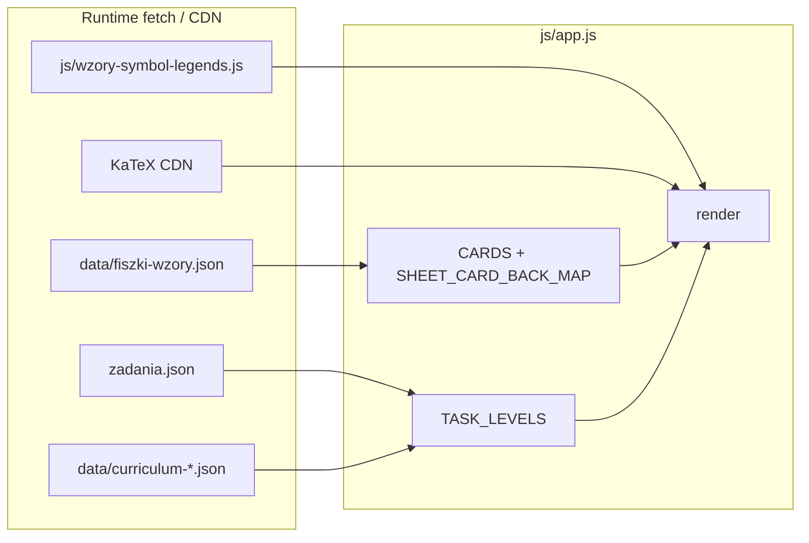

# Single Source of Truth — stan aplikacji „Fiszki”

Dokument opisuje **aktualny stan** repozytorium: źródła JSON, jeden plik `js/app.js` (router + render + logika), `css/styles.css`, `index.html` oraz przepływy UX (menu, fiszki, karta wzorów, zadania z bramką `formulaQuiz`). Służy jako punkt odniesienia przy zmianach w danych i UI.

---

## 1. Struktura danych i powiązania

### 1.1 `data/fiszki-wzory.json` (fiszki / wzory CKE — **używane w runtime**)

- **Ładowanie:** `fetch("data/fiszki-wzory.json")` w `loadFiszkiWzory()` na początku `boot()`.
- **Format:** obiekt z polami `version`, `source` (informacyjnie: źródło `js/cards-wzory-cke.js`), tablica **`cards`**.
- **Pojedyncza karta (`cards[]`):**

| Pole | Znaczenie |
|------|-----------|
| `topic` | Nazwa działu (jak na karcie CKE). |
| `name` | Nazwa wzoru — w aplikacji **`front`** (zgodność z legendą i `sheetCardRefs` w zadaniach). |
| `symbol` | LaTeX lewej strony pierwszej relacji (`=`, `\le`, `\ge`, `\approx`) — w aplikacji **`symbolLatex`**; pusty / brak sensownego LHS → `null`. |
| `correct_latex` | Poprawny wzór KaTeX — mapowany na **`back`**. |
| `distractors` | Zwykle **3** łańcuchy LaTeX — **`quizDistractors`**. W quizie fiszek (**`buildFlashQuizChoices`**) trzy błędne odpowiedzi to najpierw losowe **`back`** innych kart z **tego samego działu** (`topic`), potem z całego poziomu (**`cardsForHomeLevel`**), potem z **`quizDistractors`**, na końcu z globalnego **`CARDS`**; kolejność czterech wariantów — **`fisherYatesShuffle`**. |

- **Regeneracja:** `node tools/gen-fiszki-wzory-json.mjs` (wejście: `js/cards-wzory-cke.js` → wyjście: `data/fiszki-wzory.json`). `cards-wzory-cke.js` **nie** jest `<script>` w `index.html`.

- **Legenda symboli:** `js/wzory-symbol-legends.js` ustawia `window.__WZORY_SYMBOL_LEGEND__`. Klucz = **`sheetSymbolLegendKey(topic, front)`** = `trim(topic) + '\x1e' + trim(front)` (`front` = `name` z JSON). Generator: `python tools/gen_wzory_symbol_legends.py` (spójny klucz po `.strip()` w skrypcie).

- **Zadania:** opcjonalne **`sheetCardRefs`** — pary `[topic, nazwaKarty]`; druga wartość = `name` / `front` fiszki, żeby `getTaskSheetLines()` i `SHEET_CARD_BACK_MAP` znalazły ten sam wzór co legenda.

### 1.2 `zadania.json` (katalog główny — **źródło zadań w runtime**)

- **Ładowanie:** `fetch("zadania.json")` w `loadZadaniaJson()` w `boot()` — nadpisuje **`TASK_LEVELS`**. Tablica poziomów obejmuje co najmniej **`lo-rozszerzenie`**, **`lo-podstawa`**, **`sp`** (id muszą zgadzać się z **`CURRICULUM_FILES`** / menu), każdy z własną tablicą **`sections`**. Dla każdego poziomu normalizowane są `sections` i `tasks` (puste tablice, gdy brak w JSON).
- **Jedyny plik zadań w przeglądarce** — nie ma osobnego `data/gemini-zadania.json` w tym przepływie.

**Bramka (`task-detail`):** `taskNeedsQuizGate(t)` jest **true**, gdy istnieje **`formulaQuiz`** z tablicą **`choices`** o długości **≥ 4**. Wtedy renderowany jest quiz; przyciski „Pokaż wzory / odpowiedź / pełne rozwiązanie” są **`disabled`** + **`btn-gated`**, dopóki **`taskQuizSolved`**. Opcje quizu: **`quiz-options quiz-options--stack task-quiz-options`** (jedna kolumna); każda opcja w **`.task-quiz-option-cell`** (przycisk + ewentualny blok rationale pod błędnym wyborem).

**Schemat `formulaQuiz`:**

| Pole | Typ | Opis |
|------|-----|------|
| `lhsLatex` | string | LHS / symbol kontekstu (m.in. legenda dopasowana przez `taskFormulaQuizLegendHaystack`). |
| `prompt` | string | Treść pytania (mixed → `richMixedLinesToHtml`). |
| `choices` | tablica (oczekiwane **4** obiekty) | `katex`, `correct`, opcjonalnie `distractorRationale`. |

**`distractorRationale`:** pod wybraną błędną opcją (`.task-quiz-option-rationale`), po **`richMixedLinesToHtml`**.

**Po odblokowaniu bramki:** pod **`#task-solution`** — **`.task-quiz-symbol-legend`** (symbole z bazy legendy dopasowane do łańcucha z quizu).

### 1.3 `data/curriculum-*.json`

| Plik | Poziom (`level.id`) |
|------|----------------------|
| `curriculum-lo-rozszerzenie.json` | `lo-rozszerzenie` |
| `curriculum-lo-podstawa.json` | `lo-podstawa` |
| `curriculum-sp.json` | `sp` |

- **Ładowanie:** `loadCurriculaAndLinks()` — błąd HTTP → wyjątek → **`showAppBootError()`**.
- **Treść:** drzewo **`curriculum`**; liście mogą mieć **`sectionRefs`** (id sekcji z `level.sections`). **UI:** ekran **`task-chapters`** (bez wybranego działu) pokazuje **drzewo programu**: rozdziały z planu (klik rozwija), podrozdziały jako liście (klik → lista zadań); przy **„Wszystkie”** w zakładkach klasy — nagłówki **Klasa I…** i pełne drzewo. Gdy poziom **nie** ma sensownego planu — płaska lista **`level.sections`** (filtrowana jak wcześniej przez **`sectionsForTaskClassFilter`**). Zawsze widać działy **z 0 zadań** (**`tasksLabel`**). **`getTaskSectionView`** scala zadania z wielu **`sectionRefs`** przy wejściu z liścia programu.
- **Powiązania:** `CURRICULUM_LINKS_BY_LEVEL`, `applyStaticCurriculumLinks`, `augmentGeminiCurriculumRefs`, **`applyHeuristicCurriculumSectionRefs`** (dla **`lo-podstawa`** i **`sp`** — domyślne `sectionRefs` dla liści bez jawnego mapowania), `syncCurriculumImportFolder` (folder „import” z nieprzypiętymi sekcjami).

### 1.4 Diagram zależności (uproszczony)

### 1.5 Shell (`index.html`)

- **`#app`** — jedyny kontener UI; klasa **`app`**.
- **Style:** lokalny `css/styles.css` + **`katex.min.css`** z jsDelivr.
- **Skrypty `defer` (kolejność):** `katex.min.js` → **`js/wzory-symbol-legends.js`** → **`js/app.js`** (legenda musi być przed pierwszym `render()` używającym `__WZORY_SYMBOL_LEGEND__`).

---

## 2. Architektura logiki (`js/app.js`)

### 2.1 Stan globalny (najważniejsze zmienne)

| Zmienna | Rola |
|---------|------|
| **`screen`** | `'main' \| 'flash-study' \| 'flash-complete' \| 'task-chapters' \| 'task-detail'`. |
| **`mainTab`** | `'fiszki' \| 'zadania' \| 'karta-wzorow'` — widoczny panel na `main`. |
| **`homeLevelId`** | Id poziomu z menu (**`HOME_LEVEL_TAB_ORDER`**) — fiszki / karta wzorów + domyślny poziom dla wejścia w zadania; może wskazywać poziom **niewystępujący** w `zadania.json` (wtedy nagłówek z fallbacku, zadania mogą wymagać osobnych wpisów w JSON). |
| **`sheetTopicIndex`** | Aktywny dział na ekranie **Karta wzorów**. |
| **`flashIndex`**, **`deck`** | Pozycja i talia w quizie fiszek; start z panelu **Fiszki**: **Szybka 10** (`fisherYatesShuffle` + max 10 kart), **Powtórka** (tylko `flashProgress[front]==='wrong'`), lub kafelek **działu** (wszystkie karty działu, losowo). |
| **`flashQuizPicked`** | `null` lub indeks wybranej opcji w **`quiz.choices`** (długość tablicy = liczba przycisków, zwykle 4). |
| **`flashQuizCache`** | `{ index, choices, correctIndex }` dla bieżącej karty (`index === flashIndex`); unieważniane przy zmianie karty / wyjściu. |
| **`flashProgress`** | `Record<string, 'correct'|'wrong'>` — postęp quizu fiszek: klucz = **`card.front`** (nazwa wzoru); brak klucza = niewyświetlony. Odczyt/zapis: **`localStorage`** pod kluczem **`fiszki_progress`** (`JSON.parse` / `JSON.stringify`); aktualizacja przy wyborze odpowiedzi w **`flash-study`**. |
| **`taskLevelId`**, **`taskSectionId`**, **`taskCurriculumPath`**, **`taskIndex`** | Nawigacja zadań: poziom, wybrany dział — **`id` sekcji z `level.sections`** albo **`id` liścia z `curriculum`** (wtedy **`getTaskSectionView`** scala **`sectionRefs`**), indeks zadania. **`taskCurriculumPath`** — zerowane przy wejściu w zadania / cofnięciach; **nie** steruje UI listy. |
| **`taskClassTabId`** | `""` = wszystkie klasy w drzewie / wszystkie działy w trybie płaskim; inaczej `id` węzła **klasy** z pierwszego poziomu **`level.curriculum`**. Zerowane jak wcześniej. |
| **`taskCurriculumExpandedIds`** | `Set` identyfikatorów **rozgałęzień** planu (`curriculum`), rozwiniętych na **`task-chapters`**. Czyszczone przy zmianie klasy (**`data-task-class`**), poziomu menu, wejściu w **Zadania**, **← Menu**, przejściu do Fiszki/Karta. |
| **`taskAnswerVisible`**, **`taskFormulasVisible`**, **`taskSolutionVisible`** | Rozwinięcie bloków `#task-answer`, `#formulas-box`, `#task-solution`. |
| **`lastTaskQuizGateKey`**, **`taskQuizPickIndex`**, **`taskQuizSolved`**, **`taskQuizUnlockAnim`** | Stan bramki: klucz `level\x1esection\x1eindex`, wybór w quizie, czy odblokowano, flaga jednorazowej animacji po poprawnej odpowiedzi. |

**Dane:** `CARDS`, `SHEET_CARD_BACK_MAP` (`rebuildSheetCardBackMap`), **`TASK_LEVELS`** (z JSON + `curriculum` z plików planu).

### 2.2 Boot aplikacji

1. **`showAppLoadingState()`** → markup **`app-loading`**.
2. **`await loadFiszkiWzory()`** — sukces HTTP + niepusta `cards` → `CARDS` + mapa wzorów.
3. **`await loadZadaniaJson()`** — sukces **`zadania.json`** → `TASK_LEVELS`. **`homeLevelId`** musi być jednym z **`HOME_LEVEL_TAB_ORDER`** (`lo-rozszerzenie` / `lo-podstawa` / `sp`); jeśli nie — ustawienie na **`TASK_LEVELS[0].id`**. **Uwaga:** plik JSON może zawierać tylko część poziomów (np. same rozszerzenie); menu i tak pokazuje trzy zakładki — **`homeLevelId`** nie jest wtedy nadpisywany pierwszym wpisem z JSON przy wyborze „podstawa” / „SP”.
4. **`await loadCurriculaAndLinks()`** — dla każdego poziomu z `CURRICULUM_FILES` wczytanie planu i powiązania.
5. **`installAppRootDelegation()`** — jednorazowa delegacja zdarzeń na **`#app`** (w `try` przed pierwszym **`render()`**).
6. **`render()`** — pierwszy pełny UI.

**Błędy:** `catch` w `boot()` → `console.error` + **`showAppBootError()`** + przycisk przeładowania strony.

### 2.3 Kluczowe funkcje i pipeline

| Funkcja | Odpowiedzialność |
|---------|------------------|
| **`render()`** | Router ekranów w **jednym łańcuchu `if` / `else if`**; na **`main`** po `innerHTML` wywołuje **`applyMainTabPanels(mainTab)`** (synchronizacja `aria-selected` / `hidden` paneli). **`homeNavTabsHtml()`** — wspólne **`tabs-level`** + **`tabs-main`** na **`main`**, **`task-chapters`**, **`task-detail`**. **`homeLevelId`** jest **normalizowane** (**`ensureHomeLevelIdInMenuOrder()`**) do **`HOME_LEVEL_TAB_ORDER`**; **`hl`** w panelach: **`getLevel(homeLevelId)`** albo syntetyczny wpis z **`HOME_LEVEL_FALLBACK_TITLES`**. **Delegacja** na **`#app`**: poziomy i **`data-main-tab`** także na **`task-chapters`** / **`task-detail`** (Fiszki/Karta → **`screen = 'main'`** + **`render()`**); przy **`main`** + **Fiszki** — **`data-flash-mode`** / **`data-flash-topic`**; **`#sheet-topic-select`** — **`change`/`input`** przy **`main`** i **Karta wzorów** (handler **`onSheetTopicSelectMaybe`**). |
| **`applyMainTabPanels`**, **`installAppRootDelegation`**, **`onSheetTopicSelectMaybe`** | **`applyMainTabPanels`** — tylko gdy istnieją panele **`main`**. **`installAppRootDelegation`** — `click` na poziomach / zakładkach treści na **`main`** i widokach zadań; reszta jak wcześniej. |
| **`ensureHomeLevelIdInMenuOrder`**, **`homeNavTabsHtml`** | Normalizacja **`homeLevelId`** do menu; markup dwóch rzędów zakładek (poziom + Fiszki/Karta/Zadania). |
| **`cardsForHomeLevel`**, **`cardVisibleForHomeLevel`**, **`groupCardsByTopicInOrder`**, **`countFlashStatsForCards`**, **`flashTopicTriGradientStyle`**, **`renderFiszkiPanelInnerHtml`** | Filtrowanie fiszek wg poziomu; grupowanie po **`topic`** dla panelu Fiszki i Karty wzorów; liczniki postępu (`flashProgress`); pasek trójkolorowy; HTML zakładki **Fiszki** na **`main`**. |
| **`fisherYatesShuffle`**, **`buildFlashQuizChoices`** | Quiz fiszek: cztery warianty LaTeXu — poprawny `back` + trzy dystraktory z innych wzorów (priorytet: ten sam `topic`, potem poziom, potem `quizDistractors`, potem `CARDS`); **`fisherYatesShuffle`**. |
| **`taskNeedsQuizGate`** | Warunek bramki (`formulaQuiz` + `choices.length >= 4`). |
| **`getSection`**, **`getLevel`**, **`getTaskSheetLines`**, **`getSolutionSteps`** | Nawigacja i treść pomocnicza zadań (w tym kroki rozwiązania z `solutionSteps`). |
| **`collectSectionIdsUnderCurriculumSubtree`**, **`taskClassTabsHtml`**, **`sectionsForTaskClassFilter`**, **`normalizeTaskClassTabId`**, **`curriculumVisibleClassRoots`**, **`renderTaskCurriculumTreeHtml`**, **`renderCurriculumSubtree`**, **`countTasksOnCurriculumLeaf`**, **`countTasksUnderCurriculumNode`** | **Zadania:** zakładki klasy z **`curriculum`**; przy planie — **drzewo** rozdziałów (**`data-rozdzial-id`**) + karty podrozdziałów (**`data-curriculum-leaf-id`**); bez planu — **`sectionsForTaskClassFilter`** + płaska lista **`data-section-id`** (**w tym 0** zadań); walidacja **`taskClassTabId`**. |
| **`sheetSymbolLegendKey`**, **`getCardSymbolLegendEntries`**, **`taskFormulaQuizLegendHaystack`**, **`getLegendEntriesMatchingHaystack`**, **`symbolLegendBlockHtml`** | Legenda na fiszkach / karcie wzorów; po bramce — dopasowanie symboli do treści `formulaQuiz`. |
| **`parseFlashFormulaLines`**, **`flashQuizFormulaBlockHtml`** | Podział `back` / wariantu quizu na wiele linii (warunek w `()`, `\quad (\text{…})`, drugie równanie po `,\quad`); używane w quizie fiszek i na karcie wzorów (**`renderSheetTopicCardsHtml`**). |
| **`physicsPlainToLatex`**, **`richMixedLinesToHtml`**, **`katexHostHtml`**, **`escapeHtml`** | Konwersja treści i placeholdery **`data-katex`** na elementach **`.katex-host`**. |
| **`mountKatexIn`**, **`queueMountKatex`** | `katex.render` na hostach; przed renderem host jest czyszczony (`textContent = ''`), żeby uniknąć nakładania przy ponownym montażu. |

### 2.4 Quiz fiszek — brak „legacy” w runtime

- W **`js/app.js`** nie ma **`collectWrongTexCandidates`** ani runtime’owego dokładania puli wyłącznie z **`distractors`** w JSON: **`buildFlashQuizChoices`** dobiera **trzy błędne wzory** z innych kart (**`back`**) — priorytet ten sam **`topic`**, potem cały poziom, potem **`quizDistractors`**, potem **`CARDS`**. Heurystyki budowy **`distractors`** w JSON mogą żyć w **`tools/gen-fiszki-wzory-json.mjs`** (Node), osobno od przeglądarki.

---

## 3. Przepływ UX

### 3.1 Ekran główny (`screen === 'main'`)

- **Menu górne:** **`homeNavTabsHtml()`** — **`tabs-level`** (poziom) + **`tabs-main`** (Fiszki / Karta / Zadania); ten sam markup na **`task-chapters`** i **`task-detail`** (bez osobnego bloku „Fizyka” / długiego podtytułu nad zakładkami).
- **Delegacja na `#app`:** **`change`/`input`** dla **`#sheet-topic-select`** tylko na **`main`** i zakładce **Karta wzorów**; **`click`** na poziomach i **`data-main-tab`** także na **`task-chapters`** / **`task-detail`**. Przy **`main`** + **`mainTab === 'fiszki'`**: **`data-flash-mode="quick10"`** (10 losowych z **`cardsForHomeLevel`**, **`disabled`** gdy brak kart), **`data-flash-mode="review-wrong"`** (tylko karty ze **`flashProgress[front]==='wrong'`**, **`disabled`** gdy brak), **`data-flash-topic`** (wszystkie karty działu, losowo) → **`deck`**, **`flash-study`**, **`render()`**.
- **Poziomy:** zawsze **trzy** przyciski w **`tabs-level`** (**`HOME_LEVEL_TAB_ORDER`**). Klik ustawia **`homeLevelId`** z **`dataset`**. **`render('main')`** nie cofa wyboru do pierwszego wpisu **`TASK_LEVELS`**, gdy poziom jest na liście menu, ale **brak go w `zadania.json`** — wtedy etykiety z **`HOME_LEVEL_FALLBACK_TITLES`**; fiszki / karta wzorów nadal filtrują przez **`cardsForHomeLevel(homeLevelId)`**.
- **Treść:** **`tabs-main`** — w szablonie **`aria-selected`** według **`mainTab`**. Z **`main`**: klik Fiszki/Karta → **`applyMainTabPanels(mainTab)`** (bez pełnego **`render()`**). Z **`task-chapters`** / **`task-detail`**: Fiszki/Karta → **`screen = 'main'`**, **`render()`**.
- **Fiszki:** panel **`#panel-fiszki`** buduje **`renderFiszkiPanelInnerHtml`**: przyciski trybów (**`data-flash-mode`**) + siatka działów (**`data-flash-topic`**) z liczbami **`poprawne / błędne / niewyświetlone`** i paskiem **`linear-gradient`** (zielony / czerwony / granatowy). Postęp: **`persistFlashProgress()`** przy pierwszym wyborze odpowiedzi na karcie (**`flash-study`**, `flashProgress[card.front]`).
- **Zadania:** klik zakładki Zadania (`data-main-tab="zadania"`) → **`mainTab = 'zadania'`**, **`taskLevelId = homeLevelId`**, reset ścieżki / widoczności bloków, **`screen = 'task-chapters'`**, **`render()`** (także gdy ponownie wybierzesz Zadania z poziomu listy zadań — powrót do listy działów).

### 3.2 Fiszki — quiz (`flash-study` / `flash-complete`)

- **`flashQuizCache`** budowane przy zmianie karty (`buildFlashQuizChoices`); po pierwszym wyborze opcji: **`flashProgress[card.front] = (i === quiz.correctIndex) ? 'correct' : 'wrong'`** + **`localStorage`** (`fiszki_progress`); **`flashQuizPicked`** — przyciski **`disabled`**, klasy **`quiz-option--correct` / `--wrong-pick`**. Opcje zawsze w układzie **`quiz-options--stack`** (cztery przyciski jeden pod drugim).
- **Układ:** przed odpowiedzią — w **`.quiz-prompt-slot`** (stała wysokość `clamp`) etykieta działu i **`.quiz-question-title`**; po wyborze — **`.quiz-flip-face`** z wzorem (stos **`quiz-formula-stack`**) i legendą. **`parseFlashFormulaLines`**: druga linia dla warunku `(v_{\mathrm{źr}}\ll v_d)`, nawiasu znaków optyki, drugiego równania po `,\quad` (Doppler ścisły, **R(T)** itd.); dopisek **`s`** tylko w legendzie karty. Opcje quizu — ten sam podział, bez poszerzania przycisków w poziomie.
- **„Dalej”** na ostatniej karcie po udzieleniu odpowiedzi → **`flash-complete`** → powrót do menu czyści cache quizu.
- **KaTeX:** tylko **`queueMountKatex()`** (bez drugiego `rAF` jak w zadaniu).

### 3.3 Zadania — lista i szczegół

- **`task-chapters`:** **`homeNavTabsHtml()`**, krótki **`← Menu`** (**`#btn-back-levels`**, klasa **`btn-link-back`**), bez **`top-bar`** / „Zadania” / meta „X zadań · Y działów” nad listą. Gdy jest **`level.curriculum`** z widocznymi klasami — rząd **`.tabs-task-class`**: **„Wszystkie”** + Klasa I…; pod spodem **„Działy”** — **`renderTaskCurriculumTreeHtml`**: białe karty rozdziałów (przycisk **`data-rozdzial-id`**, przełącza **`taskCurriculumExpandedIds`** + **`render()`**), wewnątrz żółte karty podrozdziałów (**`data-curriculum-leaf-id`** → **`taskSectionId`** = id liścia, **`getSection`** przez **`getTaskSectionView`**). **Domyślnie rozdziały są zwinięte** (kontener **`.task-podrozdzial-stack`** z **`hidden`**, patrz CSS **`[hidden]`**). Przy **„Wszystkie”** — dla każdej klasy nagłówek **`task-class-heading`** i jej rozdziały. Bez planu (lub pusty) — tylko płaska lista **`data-section-id`** z **`sectionsForTaskClassFilter`**. **`taskCurriculumPath`** nie steruje tym UI.
- **`task-detail`:** **`homeNavTabsHtml()`**, potem **`top-bar`** z **`h2.top-bar-title`** „Zadanie”; dalej **`t.question`** (mixed), opcjonalnie **`formulaQuiz`** / **`taskNeedsQuizGate`** (przyciski **`data-task-quiz-opt`** — **nie** `data-quiz-opt`; **brak** **`buildFlashQuizChoices`** / **`flashQuizCache`**). Bloki **`#formulas-box`**, **`#task-answer`**, **`#task-solution`**, legenda **`.task-quiz-symbol-legend`** po bramce; **`taskQuizUnlockAnim`** → **`task-quiz-unlock-anim`**. Powrót do listy zeruje **`lastTaskQuizGateKey`**.

### 3.4 Karta wzorów

- Panel w **`#panel-karta-wzorow`**: układ **`sheet-layout`** — **kolumna** (na wszystkich szerokościach): **`#sheet-topic-select`** (Dział) **nad** przewijaną listą wzorów (**`#sheet-topic-body`**); karty z **`katexHostHtml(physicsPlainToLatex(back))`** i legendą z mapy / **`card.symbols`**.
- **SP:** nad panelem w **`renderKartaWzorowPanelHtml()`** wyświetlany jest link do zewnętrznego PDF oficjalnej karty wzorów — stała **`SP_OFFICIAL_SHEET_PDF_URL`** (`https://www.sp-sobienie.pl/images/sampledata/WZORY/wzory%20fizyka.pdf`), **`target="_blank"`**, **`rel="noopener noreferrer"`**.

---

## 4. Warstwa prezentacji (`css/styles.css`)

| Klasa / selektor | Rola |
|------------------|------|
| **`.app-loading`**, **`.app-boot-error`** | Boot / błąd ładowania. |
| **`.top-bar .top-bar-title`** | Tytuł podrzędnego ekranu zadań (**`h2`**, styl jak dawniej **`h1`** w pasku). |
| **`.tabs-task-class`** | Trzeci rząd zakładek na liście zadań — wybór klasy z planu (obok **`.tabs-level`** / **`.tabs-main`**). |
| **`.flash-mode-row`**, **`.flash-topic-grid`**, **`.flash-topic-tile`**, **`.flash-topic-bar`**, **`.flash-topic-heading`** | Panel **Fiszki** na `main`: tryby globalne, kafelki działów, pasek postępu trójkolorowy. |
| **`.task-podrozdzial-stack[hidden]`** | Wymusza **`display: none`**, bo sam **`[hidden]`** przegrywa z **`display: flex`** na **`.task-podrozdzial-stack`**. |
| **`.task-chapters-toolbar`**, **`.btn-link-back`**, **`.task-dzialy-heading`**, **`.task-class-heading`**, **`.task-rozdzial*`**, **`.task-podrozdzial-*`** | Lista **Zadania**: link wstecz, nagłówki klasy (widok „Wszystkie”), rozdziały i podrozdziały z planu programu. |
| **`.sheet-official-pdf`**, **`.sheet-official-pdf-link`**, **`.sheet-official-pdf-note`** | Link do zewnętrznego PDF karty wzorów SP (nad panelem wzorów). |
| **`.quiz-prompt-slot`**, **`.quiz-prompt-question`**, **`.quiz-card--flip`**, **`.quiz-flip-face`**, **`.quiz-flip-topic`**, **`.quiz-flip-formula`**, **`.quiz-question-title`**, **`.quiz-flip-face .symbol-legend*`** | Quiz fiszek: stały slot na pytanie/pełną fiszkę; na odwrocie — duży wzór (**`.quiz-flip-formula`** **~1.55rem**, KaTeX **~1.65em**) i nieco większa legenda niż globalna **`.symbol-legend`**; opcje **`minmax(4.15rem, auto)`**, **`minmax(0, 1fr)`**, KaTeX **~1.45em** w przyciskach. |
| **`.quiz-option`**, **`.quiz-option-formula`**, **`.quiz-formula-stack`**, **`.quiz-formula-main`**, **`.quiz-formula-hint`**, **`.sheet-formula-stack`** | Zawijanie długiego LaTeXu w opcjach; **`parseFlashFormulaLines`** + **`flashQuizFormulaBlockHtml`**: osobne linie dla `\quad (\text{…})`, warunku w `()`, drugiego równania po `,\quad`; dopisek **`s — liczba współrzędnych…`** tylko w legendzie (bez wzoru). |
| **`.quiz-options`**, **`.quiz-options--grid2`**, **`.quiz-options--stack`** | Siatka opcji quizu: **`--stack`** — jedna kolumna (fiszki + bramka zadania); **`--grid2`** — zarezerwowane (np. przyszły układ 2×2). Na wąskim ekranie reguła dla **`--grid2`** może spaść do jednej kolumny. |
| **`.task-sheet .task-quiz-options.quiz-options--stack`** | Bramka zadania: **`grid-auto-rows: auto`** — komórki z rationale mogą rosnąć. |
| **`.task-quiz-option-cell`**, **`.task-quiz-option-rationale`*** | Komórka opcji bramki + tekst wskazówki pod błędnym wyborem. |
| **`.task-quiz-unlock-anim`** + **`@keyframes task-quiz-unlock-in`** | Animacja **`.task-actions`** po poprawnej odpowiedzi. |
| **`.task-quiz-symbol-legend`** | Legenda po bramce (siatka 2 kolumn od ~`28rem`). |
| **`.quiz-option.is-vector-distractor`** | Wzmocnienie zapisu wektorowego (fiszki i zadania — gdy w LaTeX opcji jest **`\vec`**). |
| **`.quiz-option--correct`**, **`.quiz-option--wrong-pick`**, **`.btn-gated`** | Stany odpowiedzi i zablokowane przyciski przy bramce. |
| **`.answer-block.hidden`**, **`.formulas-block.hidden`**, **`.solution-block.hidden`** | Ukrycie bloków do czasu „Pokaż…”. |

---

## 5. Skrót plików wejścia/wyjścia

| Zasób | Ścieżka | Używany w przeglądarce |
|-------|---------|-------------------------|
| Fiszki CKE | `data/fiszki-wzory.json` | Tak |
| Karta wzorów SP (PDF, zewnętrzna) | `https://www.sp-sobienie.pl/images/sampledata/WZORY/wzory%20fizyka.pdf` | Tak (link w UI przy **`homeLevelId === 'sp'`**; stała **`SP_OFFICIAL_SHEET_PDF_URL`** w `app.js`) |
| Zadania | `zadania.json` (root) | Tak |
| Plany programu | `data/curriculum-*.json` | Tak |
| KaTeX | CDN jsDelivr (`katex.min.js` / `.css`) | Tak |
| Legenda symboli | `js/wzory-symbol-legends.js` | Tak (przed `app.js`) |
| Logika | `js/app.js` | Tak |
| Style | `css/styles.css` | Tak |
| Shell | `index.html` | Tak |
| Źródło generatora fiszek JSON | `js/cards-wzory-cke.js` | Tylko Node (`tools/gen-fiszki-wzory-json.mjs`) |
| Generator legendy | `tools/gen_wzory_symbol_legends.py` | Tylko Node |

---

*Dokument zsynchronizowany ze stanem kodu i ścieżek danych w repozytorium; po większych zmianach w `app.js` lub kontrakcie JSON należy go uaktualnić.*
