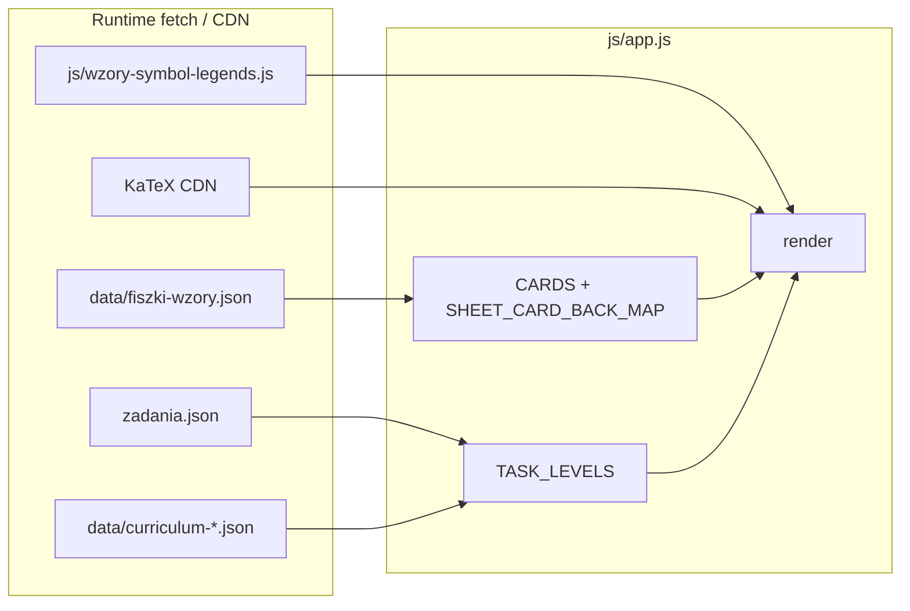

# Single Source of Truth — stan aplikacji „Fiszki”

Dokument opisuje **aktualny stan** repozytorium: źródła JSON, jeden plik `js/app.js` (router + render + logika), `css/styles.css`, `index.html` oraz przepływy UX (menu, fiszki, karta wzorów, zadania z bramką `formulaQuiz`). Służy jako punkt odniesienia przy zmianach w danych i UI.

---

## 1. Struktura danych i powiązania

### 1.1 `data/fiszki-wzory.json` (fiszki / wzory CKE — **używane w runtime**)

- **Ładowanie:** `fetch("data/fiszki-wzory.json")` w `loadFiszkiWzory()` na początku `boot()`.
- **Format:** obiekt z polami `version`, `source` (informacyjnie: źródło `js/cards-wzory-cke.js`), tablica **`cards`**.
- **Pojedyncza karta (`cards[]`):**

| Pole | Znaczenie |
|------|-----------|
| `topic` | Nazwa działu (jak na karcie CKE). |
| `name` | Nazwa wzoru — w aplikacji **`front`** (zgodność z legendą i `sheetCardRefs` w zadaniach). |
| `symbol` | LaTeX lewej strony pierwszej relacji (`=`, `\le`, `\ge`, `\approx`) — w aplikacji **`symbolLatex`**; pusty / brak sensownego LHS → `null`. |
| `correct_latex` | Poprawny wzór KaTeX — mapowany na **`back`**. |
| `distractors` | Zwykle **3** łańcuchy LaTeX — **`quizDistractors`**. Quiz fiszek (`buildFlashQuizChoices`) buduje pulę **`[back, ...unikalne dystraktory]`** (max 3 błędne, bez duplikatu poprawnej odpowiedzi), potem **`fisherYatesShuffle`**. W przeglądarce **nie** generuje się sztucznych dystraktorów. |

- **Regeneracja:** `node tools/gen-fiszki-wzory-json.mjs` (wejście: `js/cards-wzory-cke.js` → wyjście: `data/fiszki-wzory.json`). `cards-wzory-cke.js` **nie** jest `<script>` w `index.html`.

- **Legenda symboli:** `js/wzory-symbol-legends.js` ustawia `window.__WZORY_SYMBOL_LEGEND__`. Klucz = **`sheetSymbolLegendKey(topic, front)`** = `trim(topic) + '\x1e' + trim(front)` (`front` = `name` z JSON). Generator: `python tools/gen_wzory_symbol_legends.py` (spójny klucz po `.strip()` w skrypcie).

- **Zadania:** opcjonalne **`sheetCardRefs`** — pary `[topic, nazwaKarty]`; druga wartość = `name` / `front` fiszki, żeby `getTaskSheetLines()` i `SHEET_CARD_BACK_MAP` znalazły ten sam wzór co legenda.

### 1.2 `zadania.json` (katalog główny — **źródło zadań w runtime**)

- **Ładowanie:** `fetch("zadania.json")` w `loadZadaniaJson()` w `boot()` — nadpisuje **`TASK_LEVELS`**. Dla każdego poziomu normalizowane są `sections` i `tasks` (puste tablice, gdy brak w JSON).
- **Jedyny plik zadań w przeglądarce** — nie ma osobnego `data/gemini-zadania.json` w tym przepływie.

**Bramka (`task-detail`):** `taskNeedsQuizGate(t)` jest **true**, gdy istnieje **`formulaQuiz`** z tablicą **`choices`** o długości **≥ 4**. Wtedy renderowany jest quiz; przyciski „Pokaż wzory / odpowiedź / pełne rozwiązanie” są **`disabled`** + **`btn-gated`**, dopóki **`taskQuizSolved`**. Opcje quizu: zawsze **`quiz-options quiz-options--grid2 task-quiz-options`**; każda opcja w **`.task-quiz-option-cell`** (przycisk + ewentualny blok rationale pod błędnym wyborem).

**Schemat `formulaQuiz`:**

| Pole | Typ | Opis |
|------|-----|------|
| `lhsLatex` | string | LHS / symbol kontekstu (m.in. legenda dopasowana przez `taskFormulaQuizLegendHaystack`). |
| `prompt` | string | Treść pytania (mixed → `richMixedLinesToHtml`). |
| `choices` | tablica (oczekiwane **4** obiekty) | `katex`, `correct`, opcjonalnie `distractorRationale`. |

**`distractorRationale`:** pod wybraną błędną opcją (`.task-quiz-option-rationale`), po **`richMixedLinesToHtml`**.

**Po odblokowaniu bramki:** pod **`#task-solution`** — **`.task-quiz-symbol-legend`** (symbole z bazy legendy dopasowane do łańcucha z quizu).

### 1.3 `data/curriculum-*.json`

| Plik | Poziom (`level.id`) |
|------|----------------------|
| `curriculum-lo-rozszerzenie.json` | `lo-rozszerzenie` |
| `curriculum-lo-podstawa.json` | `lo-podstawa` |
| `curriculum-sp.json` | `sp` |

- **Ładowanie:** `loadCurriculaAndLinks()` — błąd HTTP → wyjątek → **`showAppBootError()`**.
- **Treść:** drzewo **`curriculum`**; liście mogą mieć **`sectionRefs`** (id sekcji z `level.sections`).
- **Powiązania:** `CURRICULUM_LINKS_BY_LEVEL`, `applyStaticCurriculumLinks`, `augmentGeminiCurriculumRefs`, `syncCurriculumImportFolder` (folder „import” z nieprzypiętymi sekcjami).

### 1.4 Diagram zależności (uproszczony)

### 1.5 Shell (`index.html`)

- **`#app`** — jedyny kontener UI; klasa **`app`**.
- **Style:** lokalny `css/styles.css` + **`katex.min.css`** z jsDelivr.
- **Skrypty `defer` (kolejność):** `katex.min.js` → **`js/wzory-symbol-legends.js`** → **`js/app.js`** (legenda musi być przed pierwszym `render()` używającym `__WZORY_SYMBOL_LEGEND__`).

---

## 2. Architektura logiki (`js/app.js`)

### 2.1 Stan globalny (najważniejsze zmienne)

| Zmienna | Rola |
|---------|------|
| **`screen`** | `'main' \| 'flash-study' \| 'flash-complete' \| 'task-chapters' \| 'task-detail'`. |
| **`mainTab`** | `'fiszki' \| 'zadania' \| 'karta-wzorow'` — widoczny panel na `main`. |
| **`homeLevelId`** | Id poziomu z `TASK_LEVELS` — zakładki Fiszki / Karta wzorów + domyślny poziom; po `boot()` walidacja względem załadowanych poziomów. |
| **`sheetTopicIndex`** | Aktywny dział na ekranie **Karta wzorów**. |
| **`flashIndex`**, **`deck`** | Pozycja i talia w quizie fiszek; **„Losowo”** = `fisherYatesShuffle(cardsForHomeLevel(...))`, **„Kolejność”** = `.slice()` bez mieszania. |
| **`flashQuizPicked`** | `null` lub indeks wybranej opcji w **`quiz.choices`** (długość tablicy = liczba przycisków, zwykle 4). |
| **`flashQuizCache`** | `{ index, choices, correctIndex }` dla bieżącej karty (`index === flashIndex`); unieważniane przy zmianie karty / wyjściu. |
| **`taskLevelId`**, **`taskSectionId`**, **`taskCurriculumPath`**, **`taskIndex`** | Nawigacja zadania: poziom, sekcja lub ścieżka w planie, indeks zadania. |
| **`taskAnswerVisible`**, **`taskFormulasVisible`**, **`taskSolutionVisible`** | Rozwinięcie bloków `#task-answer`, `#formulas-box`, `#task-solution`. |
| **`lastTaskQuizGateKey`**, **`taskQuizPickIndex`**, **`taskQuizSolved`**, **`taskQuizUnlockAnim`** | Stan bramki: klucz `level\x1esection\x1eindex`, wybór w quizie, czy odblokowano, flaga jednorazowej animacji po poprawnej odpowiedzi. |

**Dane:** `CARDS`, `SHEET_CARD_BACK_MAP` (`rebuildSheetCardBackMap`), **`TASK_LEVELS`** (z JSON + `curriculum` z plików planu).

### 2.2 Boot aplikacji

1. **`showAppLoadingState()`** → markup **`app-loading`**.
2. **`await loadFiszkiWzory()`** — sukces HTTP + niepusta `cards` → `CARDS` + mapa wzorów.
3. **`await loadZadaniaJson()`** — sukces **`zadania.json`** → `TASK_LEVELS`; jeśli **`homeLevelId`** nie występuje w danych → ustawienie na pierwszy poziom.
4. **`await loadCurriculaAndLinks()`** — dla każdego poziomu z `CURRICULUM_FILES` wczytanie planu i powiązania.
5. **`render()`**.

**Błędy:** `catch` w `boot()` → `console.error` + **`showAppBootError()`** + przycisk przeładowania strony.

### 2.3 Kluczowe funkcje i pipeline

| Funkcja | Odpowiedzialność |
|---------|------------------|
| **`render()`** | Router ekranów w **jednym łańcuchu `if` / `else if`** (`main` → `flash-complete` → `flash-study` → `task-chapters` → `task-detail`); każda gałąź kończy się **`return`**. Na początku: **izolacja stanu** — na ekranach fiszek (`flash-study`, `flash-complete`) zerowany jest stan bramki zadania; na **`task-chapters`** / **`task-detail`** czyszczony jest stan **`flashQuizCache`** / **`flashQuizPicked`**. Nieznany **`screen`**: `console.warn`, **`screen = 'main'`**, krótki komunikat + przycisk wywołujący **`render()`** (żeby nie zostawiać starego `innerHTML` w **`#app`**). Składa `innerHTML` **`#app`**, podpina handlery, **`queueMountKatex()`** (w **`task-detail`** dodatkowo **`requestAnimationFrame(() => mountKatexIn(app))`**). |
| **`loadFiszkiWzory`**, **`loadZadaniaJson`**, **`loadCurriculaAndLinks`** | Wejście danych. |
| **`cardsForHomeLevel`**, **`cardVisibleForHomeLevel`** | Filtrowanie fiszek (wykluczenia tematów, biała lista SP, itd.). |
| **`fisherYatesShuffle`**, **`buildFlashQuizChoices`** | Mieszanie kopii tablicy; quiz fiszek wyłącznie z `back` + `quizDistractors`. |
| **`flashQuizUseCompactGrid2x2`** | `true` tylko przy **dokładnie 4** opcjach, długości ≤ 96 (po normalizacji spacji), bez `\begin` — układ **`quiz-options--grid2`** vs **`--stack`**. |
| **`taskNeedsQuizGate`** | Warunek bramki (`formulaQuiz` + `choices.length >= 4`). |
| **`getSection`**, **`getLevel`**, **`getTaskSheetLines`**, **`getSolutionSteps`** | Nawigacja i treść pomocnicza zadań (w tym kroki rozwiązania z `solutionSteps`). |
| **`sheetSymbolLegendKey`**, **`getCardSymbolLegendEntries`**, **`taskFormulaQuizLegendHaystack`**, **`getLegendEntriesMatchingHaystack`**, **`symbolLegendBlockHtml`** | Legenda na fiszkach / karcie wzorów; po bramce — dopasowanie symboli do treści `formulaQuiz`. |
| **`physicsPlainToLatex`**, **`richMixedLinesToHtml`**, **`katexHostHtml`**, **`escapeHtml`** | Konwersja treści i placeholdery **`data-katex`** na elementach **`.katex-host`**. |
| **`mountKatexIn`**, **`queueMountKatex`** | `katex.render` na hostach; przed renderem host jest czyszczony (`textContent = ''`), żeby uniknąć nakładania przy ponownym montażu. |

### 2.4 Quiz fiszek — brak „legacy” w runtime

- W **`js/app.js`** nie ma **`collectWrongTexCandidates`** ani runtime’owego dokładania puli dystraktorów — wyłącznie **`data/fiszki-wzory.json`**. Heurystyki budowy **`distractors`** w JSON mogą żyć w **`tools/gen-fiszki-wzory-json.mjs`** (Node), osobno od przeglądarki.

---

## 3. Przepływ UX

### 3.1 Ekran główny (`screen === 'main'`)

- **Poziomy:** zawsze **trzy** przyciski w **`tabs-level`** (`class="tabs tabs-level"`), `data-home-level`: **`lo-rozszerzenie`**, **`lo-podstawa`**, **`sp`** — etykieta z **`TASK_LEVELS`** lub stały fallback (`HOME_LEVEL_FALLBACK_TITLES` w `app.js`), żeby pasek nie znikał przy błędzie JSON.
- **Treść:** **`tabs-main`** — Fiszki / Karta wzorów / Zadania (`mainTab` + `hidden` na panelach).
- **Fiszki:** „Nauka (kolejność)” → `deck = cardsForHomeLevel(homeLevelId).slice()`, **`flash-study`**; „Nauka (losowo)” → **`fisherYatesShuffle`**, **`flash-study`**.
- **Zadania:** klik zakładki Zadania ustawia **`mainTab = 'zadania'`**, **`taskLevelId = homeLevelId`**, reset ścieżki / widoczności bloków, **`screen = 'task-chapters'`**, **`render()`** — lista działów / planu z **`TASK_LEVELS`** (osobny ekran, nie panel w `main`).

### 3.2 Fiszki — quiz (`flash-study` / `flash-complete`)

- **`flashQuizCache`** budowane przy zmianie karty (`buildFlashQuizChoices`); po odpowiedzi **`flashQuizPicked`** — przyciski **`disabled`**, klasy **`quiz-option--correct` / `--wrong-pick`**.
- Nagłówek quizu: **`symbolLatex`** lub wyciągnięty LHS przez **`extractFlashQuizHeadSymbolLatex`** z właściwego LaTeX.
- Po odpowiedzi: blok **„Pełna fiszka”** z wzorem i **`symbolLegendBlockHtml(getCardSymbolLegendEntries(card))`**.
- **„Dalej”** na ostatniej karcie po udzieleniu odpowiedzi → **`flash-complete`** → powrót do menu czyści cache quizu.
- **KaTeX:** tylko **`queueMountKatex()`** (bez drugiego `rAF` jak w zadaniu).

### 3.3 Zadania — lista i szczegół

- **`task-chapters`:** albo drzewo **`curriculum`** (nawigacja **`taskCurriculumPath`**, liście zadań po wybraniu liścia), albo płaska lista **`level.sections`**, jeśli brak planu. Przy wybranej sekcji z zadaniami — lista tytułów → **`task-detail`**.
- **`task-detail`:** **`t.question`** (mixed), opcjonalnie **`formulaQuiz`** / **`taskNeedsQuizGate`** (przyciski **`data-task-quiz-opt`** — **nie** `data-quiz-opt`; **brak** **`buildFlashQuizChoices`** / **`flashQuizCache`**). Bloki **`#formulas-box`**, **`#task-answer`**, **`#task-solution`**, legenda **`.task-quiz-symbol-legend`** po bramce; **`taskQuizUnlockAnim`** → **`task-quiz-unlock-anim`**. Powrót do listy zeruje **`lastTaskQuizGateKey`**.

### 3.4 Karta wzorów

- Panel w **`#panel-karta-wzorow`**: wybór działu, karty z **`katexHostHtml(physicsPlainToLatex(back))`** i legendą z mapy / **`card.symbols`**.

---

## 4. Warstwa prezentacji (`css/styles.css`)

| Klasa / selektor | Rola |
|------------------|------|
| **`.app-loading`**, **`.app-boot-error`** | Boot / błąd ładowania. |
| **`.quiz-options`**, **`.quiz-options--grid2`**, **`.quiz-options--stack`** | Układ opcji quizu fiszek; na wąskim ekranie **`@media (max-width: 360px)`** siatka 2×2 może spaść do jednej kolumny. |
| **`.task-sheet .task-quiz-options.quiz-options--grid2`** | Zadania: wiersze siatki **`auto`** (komórki z rationale mogą rosnąć). |
| **`.task-quiz-option-cell`**, **`.task-quiz-option-rationale`*** | Komórka opcji bramki + tekst wskazówki pod błędnym wyborem. |
| **`.task-quiz-unlock-anim`** + **`@keyframes task-quiz-unlock-in`** | Animacja **`.task-actions`** po poprawnej odpowiedzi. |
| **`.task-quiz-symbol-legend`** | Legenda po bramce (siatka 2 kolumn od ~`28rem`). |
| **`.quiz-option.is-vector-distractor`** | Wzmocnienie zapisu wektorowego (fiszki i zadania — gdy w LaTeX opcji jest **`\vec`**). |
| **`.quiz-option--correct`**, **`.quiz-option--wrong-pick`**, **`.btn-gated`** | Stany odpowiedzi i zablokowane przyciski przy bramce. |
| **`.answer-block.hidden`**, **`.formulas-block.hidden`**, **`.solution-block.hidden`** | Ukrycie bloków do czasu „Pokaż…”. |

---

## 5. Skrót plików wejścia/wyjścia

| Zasób | Ścieżka | Używany w przeglądarce |
|-------|---------|-------------------------|
| Fiszki CKE | `data/fiszki-wzory.json` | Tak |
| Zadania | `zadania.json` (root) | Tak |
| Plany programu | `data/curriculum-*.json` | Tak |
| KaTeX | CDN jsDelivr (`katex.min.js` / `.css`) | Tak |
| Legenda symboli | `js/wzory-symbol-legends.js` | Tak (przed `app.js`) |
| Logika | `js/app.js` | Tak |
| Style | `css/styles.css` | Tak |
| Shell | `index.html` | Tak |
| Źródło generatora fiszek JSON | `js/cards-wzory-cke.js` | Tylko Node (`tools/gen-fiszki-wzory-json.mjs`) |
| Generator legendy | `tools/gen_wzory_symbol_legends.py` | Tylko Node |

---

*Dokument zsynchronizowany ze stanem kodu i ścieżek danych w repozytorium; po większych zmianach w `app.js` lub kontrakcie JSON należy go uaktualnić.*
